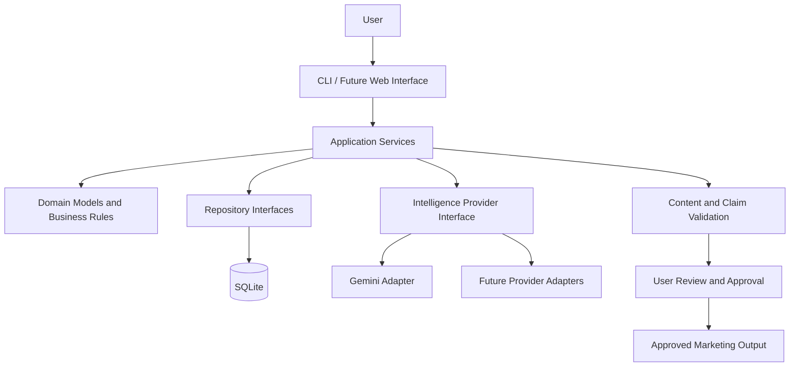
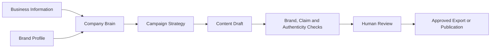

# MarketingLabAI: Third-Party Architecture Review Pack

Generated from the local repository on `2026-07-29T22:40:01+02:00`.

Secrets, likely credential files, local databases, backups, virtual environments, caches and generated outputs were excluded.

## Executive Project Description

MarketingLabAI is being developed as a commercial marketing intelligence
and execution platform.

Its purpose is to transform structured business information, brand identity,
customer understanding, commercial goals and operating constraints into
marketing strategy, campaign plans and brand-aligned content.

The intended product is not merely an AI text generator. Its long-term value
should come from the reusable Company Brain, structured workflows, business
rules, validation, campaign history, strategic insight and controlled
execution.

Artificial-intelligence providers should operate behind a provider-neutral
application layer. Customers should mainly experience MarketingLabAI's
workflow, intelligence, safeguards and results rather than the identity or
technical operation of an underlying language-model provider.

## End Goal

The long-term goal is to develop MarketingLabAI into a secure, maintainable,
multi-organisation commercial platform that can:

1. Build and maintain a structured Company Brain for each organisation.
2. Preserve brand identity, audience knowledge and commercial constraints.
3. Generate campaign strategies and brand-aligned content.
4. Validate claims, tone, authenticity and brand compliance.
5. Keep users responsible for review and publication approval.
6. Record campaign history, versions, approvals and performance.
7. support multiple model providers through a provider-neutral interface.
8. Protect prompts, internal rules, customer data and commercial logic.
9. Support multiple organisations and users with proper data isolation.
10. Deliver value beyond generic content generation.

## Known Current Status

Known completed milestones include:

- Python application foundation
- Command-line interface
- Gemini integration
- JSON persistence
- Brand Profile model and service
- Voice analysis components
- Campaign generation components
- Brand onboarding workflow
- Business Intelligence / Company Brain profile
- Integrated Company Brain onboarding
- Input validation
- Automated tests
- Black formatting
- Ruff linting
- Local health checks
- SQLite connection layer
- SQLite repository layer
- JSON-to-SQLite migration
- Migration backup and audit logging
- SQLite integrity checks
- Windows-safe SQLite connection lifecycle

## Repository Identity

```text
Project root: C:\Ai Projects\MarketingLabAI
Current branch: feature/onboarding-wizard
Current commit: 5fa29a281ce5654c84bd3eadaca023bc089def91
Short commit: 5fa29a2
Python executable: C:\Ai Projects\MarketingLabAI\.venv\Scripts\python.exe
Python version: Python 3.14.6
Pip version: pip 26.1.2 from C:\Ai Projects\MarketingLabAI\.venv\Lib\site-packages\pip (python 3.14)
```

## Git Working Tree

```text
?? docs/THIRD_PARTY_REVIEW.md
?? scripts/generate_review_pack.ps1
?? tests/test_review_pack.py
?? tools/
```

## Recent Git History

```text
5fa29a2 (HEAD -> feature/onboarding-wizard) Add SQLite persistence and JSON migration
bcf3a0e Integrate Company Brain into onboarding
6401dd7 Add Company Brain business intelligence foundation
24bb247 Add interactive onboarding workflow
235d2b5 (tag: v0.4.1, master) Add Version 0.4.1 engineering foundation
4c14c1c (tag: v0.4.0) Build Version 0.4 brand voice and campaign workflows
39b1bd7 (tag: v0.3.0) Build Version 0.3 core architecture and voice engine
86e7c1f Connect MarketingLabAI to Gemini
```

## Repository Structure

```text
.gitattributes (449 bytes)
.gitignore (1695 bytes)
app/__init__.py (5 bytes)
app/ai/__init__.py (5 bytes)
app/ai/gemini_client.py (1018 bytes)
app/brands/__init__.py (5 bytes)
app/brands/brand_service.py (896 bytes)
app/campaigns/__init__.py (5 bytes)
app/campaigns/campaign_engine.py (3309 bytes)
app/campaigns/campaign_service.py (2311 bytes)
app/cli/__init__.py (26 bytes)
app/cli/commands.py (3643 bytes)
app/config.py (1480 bytes)
app/database/__init__.py (731 bytes)
app/database/connection.py (6620 bytes)
app/database/migration.py (9306 bytes)
app/database/repositories.py (10921 bytes)
app/gemini_test.py (583 bytes)
app/health.py (1350 bytes)
app/intelligence/__init__.py (276 bytes)
app/intelligence/models.py (4178 bytes)
app/intelligence/service.py (3377 bytes)
app/main.py (4707 bytes)
app/models.py (1614 bytes)
app/services/__init__.py (5 bytes)
app/services/input_files.py (1380 bytes)
app/services/json_storage.py (1753 bytes)
app/ui/__init__.py (5 bytes)
app/voices/__init__.py (5 bytes)
app/voices/voice_engine.py (6322 bytes)
app/workflows/__init__.py (52 bytes)
app/workflows/company_brain_onboarding.py (8407 bytes)
app/workflows/onboarding.py (3621 bytes)
database/.gitkeep (0 bytes)
database/brands/.gitkeep (0 bytes)
database/brands/example-brand.json (445 bytes)
database/brands/marketinglabai-demo.json (739 bytes)
database/campaigns/.gitkeep (0 bytes)
database/campaigns/example-campaign-001-20260728-214131.json (1036 bytes)
database/campaigns/example-campaign-001-brief.json (723 bytes)
database/voices/.gitkeep (0 bytes)
database/voices/voice-4bc1a828417d.json (1433 bytes)
database/voices/voice-eb7397a4a3b5.json (1381 bytes)
docs/THIRD_PARTY_REVIEW.md (155722 bytes)
docs/product_vision.md (5776 bytes)
examples/brand.json (434 bytes)
examples/campaign.json (592 bytes)
examples/writing_samples.txt (408 bytes)
pyproject.toml (760 bytes)
requirements-dev.txt (52 bytes)
requirements.txt (44 bytes)
scripts/generate_review_pack.ps1 (398 bytes)
scripts/migrate_to_sqlite.ps1 (388 bytes)
scripts/quality.ps1 (1301 bytes)
tests/__init__.py (0 bytes)
tests/test_business_intelligence.py (6137 bytes)
tests/test_campaign_engine.py (2438 bytes)
tests/test_campaign_service.py (1379 bytes)
tests/test_company_brain_onboarding.py (7185 bytes)
tests/test_gemini_client.py (314 bytes)
tests/test_input_files.py (1642 bytes)
tests/test_json_storage.py (1291 bytes)
tests/test_main.py (717 bytes)
tests/test_models.py (1505 bytes)
tests/test_onboarding.py (4276 bytes)
tests/test_review_pack.py (5214 bytes)
tests/test_sqlite_database.py (9519 bytes)
tests/test_voice_engine.py (1473 bytes)
tests/test_voice_parsing.py (1139 bytes)
tools/__init__.py (43 bytes)
tools/review_pack.py (24606 bytes)
```

## Installed Python Packages

```text
altair==6.2.2
annotated-types==0.8.0
anyio==4.14.2
attrs==26.1.0
black==26.5.1
blinker==1.9.0
certifi==2026.7.22
cffi==2.1.0
charset-normalizer==3.4.9
click==8.4.2
colorama==0.4.6
cryptography==49.0.0
distro==1.9.0
gitdb==4.0.12
GitPython==3.1.57
google-auth==2.56.2
google-genai==2.14.0
h11==0.16.0
httpcore==1.0.9
httptools==0.8.0
httpx==0.28.1
idna==3.18
itsdangerous==2.2.0
Jinja2==3.1.6
jsonschema==4.26.0
jsonschema-specifications==2025.9.1
MarkupSafe==3.0.3
mypy_extensions==1.1.0
narwhals==2.24.0
numpy==2.5.1
packaging==26.2
pandas==3.0.5
pathspec==1.1.1
pillow==12.3.0
platformdirs==4.11.0
protobuf==7.35.1
pyarrow==24.0.0
pyasn1==0.6.4
pyasn1_modules==0.4.2
pycparser==3.0
pydantic==2.13.4
pydantic_core==2.46.4
pydeck==0.9.3
python-dateutil==2.9.0.post0
python-dotenv==1.2.2
python-multipart==0.0.32
pytokens==0.4.1
referencing==0.37.0
requests==2.34.2
rpds-py==2026.6.3
ruff==0.16.0
six==1.17.0
smmap==5.0.3
sniffio==1.3.1
starlette==1.3.1
streamlit==1.60.0
tenacity==9.1.4
toml==0.10.2
typing-inspection==0.4.2
typing_extensions==4.16.0
tzdata==2026.3
urllib3==2.7.0
uvicorn==0.51.0
watchdog==6.0.0
websockets==16.1.1
```

## Current Architecture Diagram



## Business-to-Output Data Flow



## Current Persistence Architecture

The repository currently contains both the original JSON persistence
mechanism and the newer SQLite foundation.

The SQLite foundation is expected to provide:

- Configured connections
- Foreign-key enforcement
- WAL mode
- Transaction handling
- Brand repository
- Business Intelligence repository
- Schema migrations
- Migration audit logging
- JSON backup before migration
- JSON-to-SQLite importing
- Database integrity verification

The expected next increment is to switch active application services from
JSON persistence to SQLite repositories while preserving the public service
interfaces.

## AI Visibility and Product Positioning

MarketingLabAI should present itself as a marketing intelligence and
execution platform rather than displaying model-provider branding throughout
the customer experience.

Recommended principles:

- Keep model names and raw prompts out of the normal interface.
- Use product concepts such as Company Brain, Campaign Engine, Brand Voice,
  Strategic Insight and Quality Review.
- Disclose the use of automated language and analysis technology in suitable
  help, account, policy and contractual locations.
- Do not claim human authorship or professional review when none occurred.
- Do not automatically insert AI branding into every exported item.
- Allow disclosure where legally, contractually or platform-required.
- Keep final review and publication approval with the user.
- Prevent generated content from mentioning prompts, model providers or
  system instructions unless specifically requested.
- Use a provider abstraction to avoid dependence on one vendor.

## Black Result — FAILED

```text
would reformat C:\Ai Projects\MarketingLabAI\tools\__init__.py

Oh no! \U0001f4a5 \U0001f494 \U0001f4a5
1 file would be reformatted, 43 files would be left unchanged.
```

## Ruff Result — PASSED

```text
All checks passed!
```

## Tests Result — PASSED

```text
test_profile_cleans_and_deduplicates_lists (test_business_intelligence.BusinessIntelligenceProfileTests.test_profile_cleans_and_deduplicates_lists) ... ok
test_profile_rejects_invalid_margin (test_business_intelligence.BusinessIntelligenceProfileTests.test_profile_rejects_invalid_margin) ... ok
test_profile_rejects_negative_financial_values (test_business_intelligence.BusinessIntelligenceProfileTests.test_profile_rejects_negative_financial_values) ... ok
test_profile_requires_brand_id (test_business_intelligence.BusinessIntelligenceProfileTests.test_profile_requires_brand_id) ... ok
test_profile_round_trip_dictionary_conversion (test_business_intelligence.BusinessIntelligenceProfileTests.test_profile_round_trip_dictionary_conversion) ... ok
test_service_deletes_existing_profile (test_business_intelligence.BusinessIntelligenceServiceTests.test_service_deletes_existing_profile) ... ok
test_service_lists_brand_ids_in_sorted_order (test_business_intelligence.BusinessIntelligenceServiceTests.test_service_lists_brand_ids_in_sorted_order) ... ok
test_service_overwrites_existing_profile (test_business_intelligence.BusinessIntelligenceServiceTests.test_service_overwrites_existing_profile) ... ok
test_service_raises_for_missing_profile (test_business_intelligence.BusinessIntelligenceServiceTests.test_service_raises_for_missing_profile) ... ok
test_service_rejects_invalid_brand_path (test_business_intelligence.BusinessIntelligenceServiceTests.test_service_rejects_invalid_brand_path) ... ok
test_service_reports_profile_existence (test_business_intelligence.BusinessIntelligenceServiceTests.test_service_reports_profile_existence) ... ok
test_service_saves_and_loads_profile (test_business_intelligence.BusinessIntelligenceServiceTests.test_service_saves_and_loads_profile) ... ok
test_campaign_prompt_contains_authenticity_rules (test_campaign_engine.CampaignEngineTests.test_campaign_prompt_contains_authenticity_rules) ... ok
test_rejects_mismatched_voice (test_campaign_engine.CampaignEngineTests.test_rejects_mismatched_voice) ... ok
test_saves_generated_content (test_campaign_service.CampaignServiceTests.test_saves_generated_content) ... ok
test_collects_complete_business_intelligence_profile (test_company_brain_onboarding.CompanyBrainCollectionTests.test_collects_complete_business_intelligence_profile) ... ok
test_optional_float_accepts_formatted_number (test_company_brain_onboarding.CompanyBrainInputTests.test_optional_float_accepts_formatted_number) ... ok
test_optional_float_allows_blank_value (test_company_brain_onboarding.CompanyBrainInputTests.test_optional_float_allows_blank_value) ... ok
test_optional_float_enforces_maximum (test_company_brain_onboarding.CompanyBrainInputTests.test_optional_float_enforces_maximum) ... ok
test_optional_float_retries_invalid_value (test_company_brain_onboarding.CompanyBrainInputTests.test_optional_float_retries_invalid_value) ... ok
test_optional_integer_accepts_whole_number (test_company_brain_onboarding.CompanyBrainInputTests.test_optional_integer_accepts_whole_number) ... ok
test_parse_comma_separated_cleans_and_deduplicates (test_company_brain_onboarding.CompanyBrainInputTests.test_parse_comma_separated_cleans_and_deduplicates) ... ok
test_yes_no_retries_invalid_answer (test_company_brain_onboarding.CompanyBrainInputTests.test_yes_no_retries_invalid_answer) ... ok
test_yes_no_uses_default_for_blank_answer (test_company_brain_onboarding.CompanyBrainInputTests.test_yes_no_uses_default_for_blank_answer) ... ok
test_run_onboarding_allows_company_brain_to_be_skipped (test_company_brain_onboarding.IntegratedOnboardingTests.test_run_onboarding_allows_company_brain_to_be_skipped) ... ok
test_run_onboarding_does_not_overwrite_duplicate_brand (test_company_brain_onboarding.IntegratedOnboardingTests.test_run_onboarding_does_not_overwrite_duplicate_brand) ... ok
test_run_onboarding_saves_brand_and_company_brain (test_company_brain_onboarding.IntegratedOnboardingTests.test_run_onboarding_saves_brand_and_company_brain) ... ok
test_reads_json_object (test_input_files.InputFileTests.test_reads_json_object) ... ok
test_reads_multiple_writing_samples (test_input_files.InputFileTests.test_reads_multiple_writing_samples) ... ok
test_rejects_json_array (test_input_files.InputFileTests.test_rejects_json_array) ... ok
test_list_records (test_json_storage.JsonStorageTests.test_list_records) ... ok
test_rejects_invalid_record_id (test_json_storage.JsonStorageTests.test_rejects_invalid_record_id) ... ok
test_save_and_load_record (test_json_storage.JsonStorageTests.test_save_and_load_record) ... ok
test_onboard_command_runs_workflow (test_main.MainCliTests.test_onboard_command_runs_workflow) ... ok
test_parser_accepts_onboard_command (test_main.MainCliTests.test_parser_accepts_onboard_command) ... ok
test_brand_profile_to_dict (test_models.ModelTests.test_brand_profile_to_dict) ... ok
test_campaign_brief_to_dict (test_models.ModelTests.test_campaign_brief_to_dict) ... ok
test_voice_profile_to_dict (test_models.ModelTests.test_voice_profile_to_dict) ... ok
test_collects_complete_brand_profile (test_onboarding.OnboardingWorkflowTests.test_collects_complete_brand_profile) ... ok
test_creates_safe_brand_id (test_onboarding.OnboardingWorkflowTests.test_creates_safe_brand_id) ... ok
test_parses_comma_separated_values (test_onboarding.OnboardingWorkflowTests.test_parses_comma_separated_values) ... ok
test_rejects_brand_name_without_valid_characters (test_onboarding.OnboardingWorkflowTests.test_rejects_brand_name_without_valid_characters) ... ok
test_removes_special_characters_from_brand_id (test_onboarding.OnboardingWorkflowTests.test_removes_special_characters_from_brand_id) ... ok
test_required_value_retries_after_blank_answer (test_onboarding.OnboardingWorkflowTests.test_required_value_retries_after_blank_answer) ... ok
test_run_onboarding_rejects_duplicate_brand (test_onboarding.OnboardingWorkflowTests.test_run_onboarding_rejects_duplicate_brand) ... ok
test_run_onboarding_saves_brand (test_onboarding.OnboardingWorkflowTests.test_run_onboarding_saves_brand) ... ok
test_allows_normal_python_source (test_review_pack.ExclusionTests.test_allows_normal_python_source) ... ok
test_excludes_environment_file (test_review_pack.ExclusionTests.test_excludes_environment_file) ... ok
test_excludes_sqlite_database (test_review_pack.ExclusionTests.test_excludes_sqlite_database) ... ok
test_excludes_virtual_environment (test_review_pack.ExclusionTests.test_excludes_virtual_environment) ... ok
test_collection_skips_database_and_cache_files (test_review_pack.FileCollectionTests.test_collection_skips_database_and_cache_files) ... ok
test_safe_reader_truncates_large_file (test_review_pack.FileCollectionTests.test_safe_reader_truncates_large_file) ... ok
test_redacts_google_key_pattern (test_review_pack.RedactionTests.test_redacts_google_key_pattern) ... ok
test_redacts_named_api_key (test_review_pack.RedactionTests.test_redacts_named_api_key) ... ok
test_report_contains_core_sections (test_review_pack.ReportGenerationTests.test_report_contains_core_sections) ... ok
test_selects_existing_preferred_and_python_files (test_review_pack.ReportGenerationTests.test_selects_existing_preferred_and_python_files) ... ok
test_migration_imports_brand_and_company_brain (test_sqlite_database.JsonToSQLiteMigrationTests.test_migration_imports_brand_and_company_brain) ... ok
test_migration_preserves_source_files (test_sqlite_database.JsonToSQLiteMigrationTests.test_migration_preserves_source_files) ... ok
test_second_migration_skips_existing_records (test_sqlite_database.JsonToSQLiteMigrationTests.test_second_migration_skips_existing_records) ... ok
test_brand_repository_round_trip (test_sqlite_database.RepositoryTests.test_brand_repository_round_trip) ... ok
test_brand_repository_updates_existing_record (test_sqlite_database.RepositoryTests.test_brand_repository_updates_existing_record) ... ok
test_business_intelligence_round_trip (test_sqlite_database.RepositoryTests.test_business_intelligence_round_trip) ... ok
test_initialise_creates_required_tables (test_sqlite_database.SQLiteDatabaseTests.test_initialise_creates_required_tables) ... ok
test_integrity_check_returns_ok (test_sqlite_database.SQLiteDatabaseTests.test_integrity_check_returns_ok) ... ok
test_read_connection_is_closed_after_context (test_sqlite_database.SQLiteDatabaseTests.test_read_connection_is_closed_after_context) ... ok
test_transaction_rolls_back_after_error (test_sqlite_database.SQLiteDatabaseTests.test_transaction_rolls_back_after_error) ... ok
test_prompt_contains_brand_information (test_voice_engine.VoiceEngineTests.test_prompt_contains_brand_information) ... ok
test_requires_writing_sample (test_voice_engine.VoiceEngineTests.test_requires_writing_sample) ... ok
test_parses_markdown_json_fence (test_voice_parsing.VoiceParsingTests.test_parses_markdown_json_fence) ... ok
test_parses_plain_json (test_voice_parsing.VoiceParsingTests.test_parses_plain_json) ... ok
test_validation_detects_missing_fields (test_voice_parsing.VoiceParsingTests.test_validation_detects_missing_fields) ... ok

----------------------------------------------------------------------
Ran 71 tests in 0.488s

OK
```

# Selected Source Files

## File: `pyproject.toml`

```toml
[project]
name = "marketinglabai"
version = "0.4.1"
description = "AI marketing operating system with brand voice preservation"
readme = "README.md"
requires-python = ">=3.11"
dependencies = [
    "google-genai",
    "python-dotenv",
]

[tool.black]
line-length = 88
target-version = ["py311"]
include = '\.pyi?$'
extend-exclude = '''
/(
    \.git
  | \.venv
  | backups
  | database
  | outputs
)/
'''

[tool.ruff]
line-length = 88
target-version = "py311"
exclude = [
    ".git",
    ".venv",
    "backups",
    "database",
    "outputs",
]

[tool.ruff.lint]
select = [
    "E4",
    "E7",
    "E9",
    "F",
    "I",
]

[tool.ruff.lint.isort]
known-first-party = ["app"]

[tool.ruff.format]
quote-style = "double"
indent-style = "space"
line-ending = "lf"
```

## File: `requirements.txt`

```text
google-genai==2.14.0
python-dotenv==1.2.2
```

## File: `requirements-dev.txt`

```text
-r requirements.txt

black==26.5.1
ruff==0.16.0
```

## File: `.gitignore`

```text
# ============================================================
# Secrets and local configuration
# ============================================================

.env
.env.*
!.env.example

# ============================================================
# Python virtual environments
# ============================================================

.venv/
venv/
env/

# ============================================================
# Python caches and compiled files
# ============================================================

__pycache__/
*.py[cod]
*$py.class
.pytest_cache/
.mypy_cache/
.ruff_cache/
.coverage
htmlcov/

# ============================================================
# Editors and operating systems
# ============================================================

.vscode/
.idea/
.DS_Store
Thumbs.db
desktop.ini

# ============================================================
# Runtime application data
# ============================================================

database/*
!database/.gitkeep

database/brands/*
!database/brands/.gitkeep

database/voices/*
!database/voices/.gitkeep

database/campaigns/*
!database/campaigns/.gitkeep

outputs/*
!outputs/.gitkeep

outputs/campaigns/*
!outputs/campaigns/.gitkeep

# ============================================================
# Temporary backups and logs
# ============================================================

backups/
*.log
*.tmp
*.bak

# ============================================================
# Build and package output
# ============================================================

build/
dist/
*.egg-info/

# Local SQLite runtime files
database/*.db
database/*.db-shm
database/*.db-wal
database/backups/
```

## File: `app/main.py`

```python
"""MarketingLabAI command-line application."""

import argparse
import sys

from app.cli.commands import (
    analyse_voice,
    create_brand_from_file,
    generate_campaign,
    list_brands,
    list_campaigns,
    list_voices,
    show_voice,
)
from app.health import run_health_check
from app.workflows.company_brain_onboarding import run_onboarding


def build_parser() -> argparse.ArgumentParser:
    parser = argparse.ArgumentParser(
        prog="MarketingLabAI",
        description="AI Marketing Operating System",
    )

    subparsers = parser.add_subparsers(
        dest="command",
    )

    health_parser = subparsers.add_parser(
        "health",
        help="Run system health checks.",
    )

    health_parser.add_argument(
        "--api",
        action="store_true",
        help="Include a live Gemini API test.",
    )

    brand_parser = subparsers.add_parser(
        "brand",
        help="Manage brand profiles.",
    )

    brand_subparsers = brand_parser.add_subparsers(
        dest="brand_command",
    )

    brand_create = brand_subparsers.add_parser(
        "create",
        help="Create a brand from a JSON file.",
    )

    brand_create.add_argument(
        "--file",
        required=True,
        help="Path to the brand JSON file.",
    )

    brand_subparsers.add_parser(
        "list",
        help="List saved brands.",
    )

    voice_parser = subparsers.add_parser(
        "voice",
        help="Manage brand voice profiles.",
    )

    voice_subparsers = voice_parser.add_subparsers(
        dest="voice_command",
    )

    voice_analyse = voice_subparsers.add_parser(
        "analyse",
        help="Analyse writing samples.",
    )

    voice_analyse.add_argument(
        "--brand-id",
        required=True,
    )

    voice_analyse.add_argument(
        "--samples-file",
        required=True,
    )

    voice_subparsers.add_parser(
        "list",
        help="List saved voice profiles.",
    )

    voice_show = voice_subparsers.add_parser(
        "show",
        help="Display a saved voice profile.",
    )

    voice_show.add_argument(
        "--voice-id",
        required=True,
    )

    campaign_parser = subparsers.add_parser(
        "campaign",
        help="Generate and manage campaigns.",
    )

    campaign_subparsers = campaign_parser.add_subparsers(
        dest="campaign_command",
    )

    campaign_generate = campaign_subparsers.add_parser(
        "generate",
        help="Generate marketing content.",
    )

    campaign_generate.add_argument(
        "--brand-id",
        required=True,
    )

    campaign_generate.add_argument(
        "--voice-id",
        required=True,
    )

    campaign_generate.add_argument(
        "--brief-file",
        required=True,
    )

    campaign_subparsers.add_parser(
        "list",
        help="List saved campaign records.",
    )

    subparsers.add_parser(
        "onboard",
        help="Interactively onboard a new business.",
    )

    return parser


def run_command(args: argparse.Namespace) -> None:
    if args.command == "health":
        run_health_check(include_api_test=args.api)
        return

    if args.command == "onboard":
        run_onboarding()
        return

    if args.command == "brand":
        if args.brand_command == "create":
            create_brand_from_file(args.file)
            return

        if args.brand_command == "list":
            list_brands()
            return

    if args.command == "voice":
        if args.voice_command == "analyse":
            analyse_voice(
                brand_id=args.brand_id,
                samples_file=args.samples_file,
            )
            return

        if args.voice_command == "list":
            list_voices()
            return

        if args.voice_command == "show":
            show_voice(args.voice_id)
            return

    if args.command == "campaign":
        if args.campaign_command == "generate":
            generate_campaign(
                brand_id=args.brand_id,
                voice_id=args.voice_id,
                brief_file=args.brief_file,
            )
            return

        if args.campaign_command == "list":
            list_campaigns()
            return

    raise ValueError("No valid command was selected. " "Run: python -m app.main --help")


def main() -> None:
    parser = build_parser()

    if len(sys.argv) == 1:
        parser.print_help()
        return

    args = parser.parse_args()

    try:
        run_command(args)
    except Exception as error:
        print(
            f"ERROR: {error}",
            file=sys.stderr,
        )
        raise SystemExit(1) from error


if __name__ == "__main__":
    main()
```

## File: `app/config.py`

```python
"""Application configuration for MarketingLabAI."""

import os
from dataclasses import dataclass
from pathlib import Path

from dotenv import load_dotenv

PROJECT_ROOT = Path(__file__).resolve().parent.parent
ENV_FILE = PROJECT_ROOT / ".env"

DATABASE_FOLDER = PROJECT_ROOT / "database"
OUTPUT_FOLDER = PROJECT_ROOT / "outputs"
ASSETS_FOLDER = PROJECT_ROOT / "assets"
PROMPTS_FOLDER = PROJECT_ROOT / "prompts"


@dataclass(frozen=True)
class Settings:
    project_root: Path
    gemini_api_key: str
    gemini_model: str
    database_folder: Path
    output_folder: Path
    assets_folder: Path
    prompts_folder: Path


def create_required_folders():
    for folder in (
        DATABASE_FOLDER,
        OUTPUT_FOLDER,
        ASSETS_FOLDER,
        PROMPTS_FOLDER,
    ):
        folder.mkdir(parents=True, exist_ok=True)


def load_settings():
    if not ENV_FILE.exists():
        raise FileNotFoundError(f"Missing .env file: {ENV_FILE}")

    load_dotenv(ENV_FILE)

    api_key = [REDACTED]
    model = os.getenv("GEMINI_MODEL", "gemini-3.6-flash").strip()

    if not api_key:
        raise ValueError("GEMINI_API_KEY is missing.")

    create_required_folders()

    return Settings(
        project_root=PROJECT_ROOT,
        gemini_api_key=api_key,
        gemini_model=model,
        database_folder=DATABASE_FOLDER,
        output_folder=OUTPUT_FOLDER,
        assets_folder=ASSETS_FOLDER,
        prompts_folder=PROMPTS_FOLDER,
    )
```

## File: `app/models.py`

```python
"""Core data models for MarketingLabAI."""

from dataclasses import asdict, dataclass, field
from typing import Any


@dataclass
class BrandProfile:
    """Represents a company or organisation using MarketingLabAI."""

    brand_id: str
    name: str
    industry: str
    description: str
    target_audience: str
    products_or_services: list[str] = field(default_factory=list)
    values: list[str] = field(default_factory=list)
    website: str = ""

    def to_dict(self) -> dict[str, Any]:
        return asdict(self)


@dataclass
class VoiceProfile:
    """Defines how a brand communicates."""

    voice_id: str
    brand_id: str
    summary: str
    tone_traits: list[str]
    preferred_words: list[str] = field(default_factory=list)
    avoided_words: list[str] = field(default_factory=list)
    sentence_style: str = ""
    call_to_action_style: str = ""
    authenticity_rules: list[str] = field(default_factory=list)

    def to_dict(self) -> dict[str, Any]:
        return asdict(self)


@dataclass
class CampaignBrief:
    """Input requirements for a marketing campaign."""

    campaign_id: str
    brand_id: str
    objective: str
    audience: str
    offer: str
    platform: str
    content_type: str
    key_message: str
    call_to_action: str
    additional_context: str = ""

    def to_dict(self) -> dict[str, Any]:
        return asdict(self)


@dataclass
class GeneratedContent:
    """A generated marketing asset."""

    campaign_id: str
    platform: str
    content_type: str
    content: str
    model: str

    def to_dict(self) -> dict[str, Any]:
        return asdict(self)
```

## File: `app/database/__init__.py`

```python
"""SQLite persistence components for MarketingLabAI."""

from __future__ import annotations

from typing import Any

from app.database.connection import SQLiteDatabase
from app.database.repositories import (
    BrandRepository,
    BusinessIntelligenceRepository,
)

__all__ = [
    "SQLiteDatabase",
    "JsonToSQLiteMigrator",
    "BrandRepository",
    "BusinessIntelligenceRepository",
]


def __getattr__(name: str) -> Any:
    """Load migration components only when explicitly requested."""

    if name == "JsonToSQLiteMigrator":
        from app.database.migration import JsonToSQLiteMigrator

        return JsonToSQLiteMigrator

    raise AttributeError(
        f"module 'app.database' has no attribute {name!r}"
    )
```

## File: `app/database/connection.py`

```python
"""SQLite connection management for MarketingLabAI."""

from __future__ import annotations

import sqlite3
from collections.abc import Iterator
from contextlib import contextmanager
from pathlib import Path


class SQLiteDatabase:
    """Manage SQLite connections and database initialisation."""

    def __init__(
        self,
        database_path: str | Path = "database/marketinglabai.db",
    ) -> None:
        self.database_path = Path(database_path)
        self.database_path.parent.mkdir(parents=True, exist_ok=True)

    def connect(self) -> sqlite3.Connection:
        """Create and return a configured SQLite connection."""

        connection = sqlite3.connect(
            self.database_path,
            timeout=30,
        )
        connection.row_factory = sqlite3.Row
        connection.execute("PRAGMA foreign_keys = ON")
        connection.execute("PRAGMA journal_mode = WAL")
        connection.execute("PRAGMA synchronous = NORMAL")
        connection.execute("PRAGMA busy_timeout = 30000")

        return connection

    @contextmanager
    def connection(self) -> Iterator[sqlite3.Connection]:
        """Provide a connection that is always closed after use."""

        connection = self.connect()

        try:
            yield connection
        finally:
            connection.close()

    @contextmanager
    def transaction(self) -> Iterator[sqlite3.Connection]:
        """Provide a transaction with commit, rollback, and guaranteed close."""

        connection = self.connect()

        try:
            connection.execute("BEGIN")
            yield connection
            connection.commit()
        except Exception:
            connection.rollback()
            raise
        finally:
            connection.close()

    def initialise(self) -> None:
        """Create all current database tables and indexes."""

        with self.transaction() as connection:
            connection.executescript(
                """
                CREATE TABLE IF NOT EXISTS schema_migrations (
                    version INTEGER PRIMARY KEY,
                    description TEXT NOT NULL,
                    applied_at TEXT NOT NULL
                );

                CREATE TABLE IF NOT EXISTS brands (
                    brand_id TEXT PRIMARY KEY,
                    name TEXT NOT NULL,
                    industry TEXT NOT NULL DEFAULT '',
                    description TEXT NOT NULL DEFAULT '',
                    target_audience_json TEXT NOT NULL DEFAULT '[]',
                    products_json TEXT NOT NULL DEFAULT '[]',
                    values_json TEXT NOT NULL DEFAULT '[]',
                    website TEXT NOT NULL DEFAULT '',
                    payload_json TEXT NOT NULL,
                    created_at TEXT NOT NULL,
                    updated_at TEXT NOT NULL
                );

                CREATE TABLE IF NOT EXISTS business_intelligence_profiles (
                    brand_id TEXT PRIMARY KEY,
                    revenue_model TEXT NOT NULL DEFAULT '',
                    average_order_value REAL,
                    gross_margin_percent REAL,
                    customer_lifetime_value REAL,
                    customer_acquisition_cost REAL,
                    sales_cycle_days INTEGER,
                    monthly_marketing_budget REAL,
                    team_size INTEGER,
                    sales_channels_json TEXT NOT NULL DEFAULT '[]',
                    geographic_markets_json TEXT NOT NULL DEFAULT '[]',
                    capacity_constraints_json TEXT NOT NULL DEFAULT '[]',
                    seasonality_json TEXT NOT NULL DEFAULT '[]',
                    competitors_json TEXT NOT NULL DEFAULT '[]',
                    business_goals_json TEXT NOT NULL DEFAULT '[]',
                    payload_json TEXT NOT NULL,
                    created_at TEXT NOT NULL,
                    updated_at TEXT NOT NULL,
                    FOREIGN KEY (brand_id)
                        REFERENCES brands(brand_id)
                        ON DELETE CASCADE
                );

                CREATE TABLE IF NOT EXISTS data_migration_log (
                    migration_id INTEGER PRIMARY KEY AUTOINCREMENT,
                    source_type TEXT NOT NULL,
                    source_path TEXT NOT NULL,
                    record_id TEXT NOT NULL,
                    status TEXT NOT NULL,
                    message TEXT NOT NULL DEFAULT '',
                    migrated_at TEXT NOT NULL
                );

                CREATE INDEX IF NOT EXISTS idx_brands_name
                    ON brands(name);

                CREATE INDEX IF NOT EXISTS idx_brands_industry
                    ON brands(industry);

                CREATE INDEX IF NOT EXISTS
                    idx_business_intelligence_revenue_model
                    ON business_intelligence_profiles(revenue_model);

                CREATE INDEX IF NOT EXISTS idx_data_migration_log_record
                    ON data_migration_log(source_type, record_id);
                """
            )

            connection.execute(
                """
                INSERT OR IGNORE INTO schema_migrations (
                    version,
                    description,
                    applied_at
                )
                VALUES (
                    1,
                    'Initial MarketingLabAI relational schema',
                    strftime('%Y-%m-%dT%H:%M:%fZ', 'now')
                )
                """
            )

    def table_names(self) -> list[str]:
        """Return application table names."""

        with self.connection() as connection:
            rows = connection.execute(
                """
                SELECT name
                FROM sqlite_master
                WHERE type = 'table'
                  AND name NOT LIKE 'sqlite_%'
                ORDER BY name
                """
            ).fetchall()

        return [str(row["name"]) for row in rows]

    def integrity_check(self) -> str:
        """Run SQLite's built-in database integrity check."""

        with self.connection() as connection:
            row = connection.execute(
                "PRAGMA integrity_check"
            ).fetchone()

        if row is None:
            raise RuntimeError(
                "SQLite did not return an integrity result."
            )

        return str(row[0])

    def checkpoint(self) -> None:
        """Checkpoint and truncate SQLite's write-ahead log."""

        with self.connection() as connection:
            connection.execute(
                "PRAGMA wal_checkpoint(TRUNCATE)"
            ).fetchone()
```

## File: `app/database/repositories.py`

```python
"""Relational repositories for MarketingLabAI data."""

from __future__ import annotations

import json
from datetime import UTC, datetime
from typing import Any

from app.database.connection import SQLiteDatabase
from app.intelligence.models import BusinessIntelligenceProfile


def current_utc_timestamp() -> str:
    """Return the current UTC timestamp."""

    return datetime.now(UTC).isoformat()


def encode_json(value: Any) -> str:
    """Encode a value as deterministic JSON."""

    return json.dumps(
        value,
        ensure_ascii=False,
        sort_keys=True,
    )


def decode_json(value: str) -> Any:
    """Decode stored JSON."""

    return json.loads(value)


class BrandRepository:
    """Store and retrieve brand payloads in SQLite."""

    def __init__(self, database: SQLiteDatabase | None = None) -> None:
        self.database = database or SQLiteDatabase()
        self.database.initialise()

    def save(self, payload: dict[str, Any]) -> None:
        """Insert or update a brand record."""

        brand_id = str(payload.get("brand_id", "")).strip()
        name = str(payload.get("name", "")).strip()

        if not brand_id:
            raise ValueError("brand_id is required.")

        if not name:
            raise ValueError("Brand name is required.")

        timestamp = current_utc_timestamp()

        target_audience = payload.get("target_audience", [])
        products = payload.get("products", [])
        values = payload.get("values", [])

        with self.database.transaction() as connection:
            connection.execute(
                """
                INSERT INTO brands (
                    brand_id,
                    name,
                    industry,
                    description,
                    target_audience_json,
                    products_json,
                    values_json,
                    website,
                    payload_json,
                    created_at,
                    updated_at
                )
                VALUES (?, ?, ?, ?, ?, ?, ?, ?, ?, ?, ?)
                ON CONFLICT(brand_id) DO UPDATE SET
                    name = excluded.name,
                    industry = excluded.industry,
                    description = excluded.description,
                    target_audience_json = excluded.target_audience_json,
                    products_json = excluded.products_json,
                    values_json = excluded.values_json,
                    website = excluded.website,
                    payload_json = excluded.payload_json,
                    updated_at = excluded.updated_at
                """,
                (
                    brand_id,
                    name,
                    str(payload.get("industry", "")),
                    str(payload.get("description", "")),
                    encode_json(target_audience),
                    encode_json(products),
                    encode_json(values),
                    str(payload.get("website", "")),
                    encode_json(payload),
                    timestamp,
                    timestamp,
                ),
            )

    def get(self, brand_id: str) -> dict[str, Any]:
        """Return a complete brand payload."""

        with self.database.connection() as connection:
            row = connection.execute(
                """
                SELECT payload_json
                FROM brands
                WHERE brand_id = ?
                """,
                (brand_id,),
            ).fetchone()

        if row is None:
            raise FileNotFoundError(
                f"No brand exists with ID '{brand_id}'."
            )

        payload = decode_json(str(row["payload_json"]))

        if not isinstance(payload, dict):
            raise ValueError(
                f"Invalid stored brand payload for '{brand_id}'."
            )

        return payload

    def exists(self, brand_id: str) -> bool:
        """Return whether a brand exists."""

        with self.database.connection() as connection:
            row = connection.execute(
                """
                SELECT 1
                FROM brands
                WHERE brand_id = ?
                LIMIT 1
                """,
                (brand_id,),
            ).fetchone()

        return row is not None

    def list_ids(self) -> list[str]:
        """Return all brand IDs."""

        with self.database.connection() as connection:
            rows = connection.execute(
                """
                SELECT brand_id
                FROM brands
                ORDER BY brand_id
                """
            ).fetchall()

        return [str(row["brand_id"]) for row in rows]

    def count(self) -> int:
        """Return the number of stored brands."""

        with self.database.connection() as connection:
            row = connection.execute(
                "SELECT COUNT(*) AS total FROM brands"
            ).fetchone()

        return int(row["total"]) if row else 0


class BusinessIntelligenceRepository:
    """Store and retrieve Company Brain profiles in SQLite."""

    def __init__(self, database: SQLiteDatabase | None = None) -> None:
        self.database = database or SQLiteDatabase()
        self.database.initialise()

    def save(self, profile: BusinessIntelligenceProfile) -> None:
        """Insert or update a business intelligence profile."""

        timestamp = current_utc_timestamp()
        payload = profile.to_dict()
        profile.updated_at = timestamp
        payload["updated_at"] = timestamp

        with self.database.transaction() as connection:
            connection.execute(
                """
                INSERT INTO business_intelligence_profiles (
                    brand_id,
                    revenue_model,
                    average_order_value,
                    gross_margin_percent,
                    customer_lifetime_value,
                    customer_acquisition_cost,
                    sales_cycle_days,
                    monthly_marketing_budget,
                    team_size,
                    sales_channels_json,
                    geographic_markets_json,
                    capacity_constraints_json,
                    seasonality_json,
                    competitors_json,
                    business_goals_json,
                    payload_json,
                    created_at,
                    updated_at
                )
                VALUES (
                    ?, ?, ?, ?, ?, ?, ?, ?, ?, ?, ?, ?, ?, ?, ?, ?, ?, ?
                )
                ON CONFLICT(brand_id) DO UPDATE SET
                    revenue_model = excluded.revenue_model,
                    average_order_value = excluded.average_order_value,
                    gross_margin_percent = excluded.gross_margin_percent,
                    customer_lifetime_value = excluded.customer_lifetime_value,
                    customer_acquisition_cost = excluded.customer_acquisition_cost,
                    sales_cycle_days = excluded.sales_cycle_days,
                    monthly_marketing_budget =
                        excluded.monthly_marketing_budget,
                    team_size = excluded.team_size,
                    sales_channels_json = excluded.sales_channels_json,
                    geographic_markets_json =
                        excluded.geographic_markets_json,
                    capacity_constraints_json =
                        excluded.capacity_constraints_json,
                    seasonality_json = excluded.seasonality_json,
                    competitors_json = excluded.competitors_json,
                    business_goals_json = excluded.business_goals_json,
                    payload_json = excluded.payload_json,
                    updated_at = excluded.updated_at
                """,
                (
                    profile.brand_id,
                    profile.revenue_model,
                    profile.average_order_value,
                    profile.gross_margin_percent,
                    profile.customer_lifetime_value,
                    profile.customer_acquisition_cost,
                    profile.sales_cycle_days,
                    profile.monthly_marketing_budget,
                    profile.team_size,
                    encode_json(profile.sales_channels),
                    encode_json(profile.geographic_markets),
                    encode_json(profile.capacity_constraints),
                    encode_json(profile.seasonality),
                    encode_json(profile.competitors),
                    encode_json(profile.business_goals),
                    encode_json(payload),
                    timestamp,
                    timestamp,
                ),
            )

    def get(self, brand_id: str) -> BusinessIntelligenceProfile:
        """Return the Company Brain profile for a brand."""

        with self.database.connection() as connection:
            row = connection.execute(
                """
                SELECT payload_json
                FROM business_intelligence_profiles
                WHERE brand_id = ?
                """,
                (brand_id,),
            ).fetchone()

        if row is None:
            raise FileNotFoundError(
                f"No business intelligence profile exists for '{brand_id}'."
            )

        payload = decode_json(str(row["payload_json"]))

        if not isinstance(payload, dict):
            raise ValueError(
                f"Invalid business intelligence data for '{brand_id}'."
            )

        return BusinessIntelligenceProfile.from_dict(payload)

    def exists(self, brand_id: str) -> bool:
        """Return whether a Company Brain profile exists."""

        with self.database.connection() as connection:
            row = connection.execute(
                """
                SELECT 1
                FROM business_intelligence_profiles
                WHERE brand_id = ?
                LIMIT 1
                """,
                (brand_id,),
            ).fetchone()

        return row is not None

    def list_brand_ids(self) -> list[str]:
        """Return IDs with Company Brain profiles."""

        with self.database.connection() as connection:
            rows = connection.execute(
                """
                SELECT brand_id
                FROM business_intelligence_profiles
                ORDER BY brand_id
                """
            ).fetchall()

        return [str(row["brand_id"]) for row in rows]

    def count(self) -> int:
        """Return the number of Company Brain profiles."""

        with self.database.connection() as connection:
            row = connection.execute(
                """
                SELECT COUNT(*) AS total
                FROM business_intelligence_profiles
                """
            ).fetchone()

        return int(row["total"]) if row else 0
```

## File: `app/database/migration.py`

```python
"""Import existing MarketingLabAI JSON records into SQLite."""

from __future__ import annotations

import argparse
import json
import shutil
from dataclasses import dataclass
from datetime import UTC, datetime
from pathlib import Path
from typing import Any

from app.database.connection import SQLiteDatabase
from app.database.repositories import (
    BrandRepository,
    BusinessIntelligenceRepository,
)
from app.intelligence.models import BusinessIntelligenceProfile


def current_utc_timestamp() -> str:
    """Return the current UTC timestamp."""

    return datetime.now(UTC).isoformat()


@dataclass(slots=True)
class MigrationResult:
    """Summary of one migration run."""

    brands_imported: int = 0
    intelligence_profiles_imported: int = 0
    records_skipped: int = 0
    records_failed: int = 0
    backup_directory: Path | None = None


class JsonToSQLiteMigrator:
    """Migrate existing JSON data without deleting source records."""

    def __init__(
        self,
        *,
        database: SQLiteDatabase | None = None,
        brands_directory: str | Path = "database/brands",
        intelligence_directory: str | Path = (
            "database/business_intelligence"
        ),
        backup_root: str | Path = "database/backups",
    ) -> None:
        self.database = database or SQLiteDatabase()
        self.brands_directory = Path(brands_directory)
        self.intelligence_directory = Path(intelligence_directory)
        self.backup_root = Path(backup_root)

        self.database.initialise()
        self.brand_repository = BrandRepository(self.database)
        self.intelligence_repository = BusinessIntelligenceRepository(
            self.database
        )

    def migrate(self) -> MigrationResult:
        """Back up and import all supported JSON records."""

        result = MigrationResult()
        result.backup_directory = self._create_backup()

        for path in self._json_files(self.brands_directory):
            try:
                payload = self._load_json_object(path)
                brand_id = self._extract_brand_id(payload, path)
                payload["brand_id"] = brand_id

                if self.brand_repository.exists(brand_id):
                    result.records_skipped += 1
                    self._log(
                        "brand",
                        path,
                        brand_id,
                        "skipped",
                        "Brand already exists in SQLite.",
                    )
                    continue

                self.brand_repository.save(payload)
                result.brands_imported += 1

                self._log(
                    "brand",
                    path,
                    brand_id,
                    "imported",
                    "",
                )
            except Exception as error:
                result.records_failed += 1
                self._log(
                    "brand",
                    path,
                    path.stem,
                    "failed",
                    str(error),
                )

        for path in self._json_files(self.intelligence_directory):
            try:
                payload = self._load_json_object(path)
                brand_id = self._extract_brand_id(payload, path)
                payload["brand_id"] = brand_id

                if not self.brand_repository.exists(brand_id):
                    result.records_failed += 1
                    self._log(
                        "business_intelligence",
                        path,
                        brand_id,
                        "failed",
                        "The linked brand does not exist in SQLite.",
                    )
                    continue

                if self.intelligence_repository.exists(brand_id):
                    result.records_skipped += 1
                    self._log(
                        "business_intelligence",
                        path,
                        brand_id,
                        "skipped",
                        "Profile already exists in SQLite.",
                    )
                    continue

                profile = BusinessIntelligenceProfile.from_dict(payload)
                self.intelligence_repository.save(profile)
                result.intelligence_profiles_imported += 1

                self._log(
                    "business_intelligence",
                    path,
                    brand_id,
                    "imported",
                    "",
                )
            except Exception as error:
                result.records_failed += 1
                self._log(
                    "business_intelligence",
                    path,
                    path.stem,
                    "failed",
                    str(error),
                )

        return result

    def _create_backup(self) -> Path:
        timestamp = datetime.now(UTC).strftime("%Y%m%dT%H%M%S%fZ")
        backup_directory = self.backup_root / f"json-before-sqlite-{timestamp}"
        backup_directory.mkdir(parents=True, exist_ok=False)

        self._copy_directory(
            self.brands_directory,
            backup_directory / "brands",
        )
        self._copy_directory(
            self.intelligence_directory,
            backup_directory / "business_intelligence",
        )

        return backup_directory

    @staticmethod
    def _copy_directory(source: Path, destination: Path) -> None:
        if source.exists():
            shutil.copytree(source, destination)
        else:
            destination.mkdir(parents=True, exist_ok=True)

    @staticmethod
    def _json_files(directory: Path) -> list[Path]:
        if not directory.exists():
            return []

        return sorted(
            path
            for path in directory.glob("*.json")
            if path.is_file()
        )

    @staticmethod
    def _load_json_object(path: Path) -> dict[str, Any]:
        with path.open("r", encoding="utf-8") as source_file:
            payload = json.load(source_file)

        if not isinstance(payload, dict):
            raise ValueError("The JSON root must be an object.")

        return payload

    @staticmethod
    def _extract_brand_id(
        payload: dict[str, Any],
        path: Path,
    ) -> str:
        brand_id = str(payload.get("brand_id", path.stem)).strip()

        if not brand_id:
            raise ValueError("The record does not contain a valid brand ID.")

        return brand_id

    def _log(
        self,
        source_type: str,
        source_path: Path,
        record_id: str,
        status: str,
        message: str,
    ) -> None:
        with self.database.transaction() as connection:
            connection.execute(
                """
                INSERT INTO data_migration_log (
                    source_type,
                    source_path,
                    record_id,
                    status,
                    message,
                    migrated_at
                )
                VALUES (?, ?, ?, ?, ?, ?)
                """,
                (
                    source_type,
                    str(source_path),
                    record_id,
                    status,
                    message,
                    current_utc_timestamp(),
                ),
            )


def build_parser() -> argparse.ArgumentParser:
    """Create the migration command parser."""

    parser = argparse.ArgumentParser(
        description=(
            "Import existing MarketingLabAI JSON records into SQLite."
        )
    )
    parser.add_argument(
        "--database",
        default="database/marketinglabai.db",
        help="SQLite database path.",
    )
    parser.add_argument(
        "--brands-directory",
        default="database/brands",
        help="Existing brand JSON directory.",
    )
    parser.add_argument(
        "--intelligence-directory",
        default="database/business_intelligence",
        help="Existing Company Brain JSON directory.",
    )
    parser.add_argument(
        "--backup-root",
        default="database/backups",
        help="Directory for pre-migration backups.",
    )

    return parser


def main() -> int:
    """Run the JSON-to-SQLite migration."""

    arguments = build_parser().parse_args()

    database = SQLiteDatabase(arguments.database)
    migrator = JsonToSQLiteMigrator(
        database=database,
        brands_directory=arguments.brands_directory,
        intelligence_directory=arguments.intelligence_directory,
        backup_root=arguments.backup_root,
    )

    result = migrator.migrate()

    print("")
    print("MarketingLabAI SQLite Migration")
    print("-------------------------------")
    print(f"Brands imported: {result.brands_imported}")
    print(
        "Company Brain profiles imported: "
        f"{result.intelligence_profiles_imported}"
    )
    print(f"Records skipped: {result.records_skipped}")
    print(f"Records failed: {result.records_failed}")
    print(f"Backup directory: {result.backup_directory}")
    print(f"Database integrity: {database.integrity_check()}")
    print(f"Database path: {database.database_path}")

    return 1 if result.records_failed else 0


if __name__ == "__main__":
    raise SystemExit(main())
```

## File: `app/workflows/onboarding.py`

```python
"""Interactive business onboarding workflow."""

import re
from collections.abc import Callable

from app.brands.brand_service import BrandService
from app.models import BrandProfile

InputFunction = Callable[[str], str]
OutputFunction = Callable[[str], None]


def create_brand_id(name: str) -> str:
    """Create a safe, predictable brand ID from a business name."""

    normalized = name.strip().lower()
    normalized = re.sub(r"[^a-z0-9]+", "-", normalized)
    normalized = normalized.strip("-")

    if not normalized:
        raise ValueError("A valid business name is required.")

    return normalized


def parse_comma_separated(value: str) -> list[str]:
    """Convert comma-separated text into a clean list."""

    return [item.strip() for item in value.split(",") if item.strip()]


def request_required_value(
    prompt: str,
    *,
    input_function: InputFunction = input,
    output_function: OutputFunction = print,
) -> str:
    """Request a required value until the user provides one."""

    while True:
        value = input_function(prompt).strip()

        if value:
            return value

        output_function("This field is required. Please try again.")


def collect_brand_profile(
    *,
    input_function: InputFunction = input,
    output_function: OutputFunction = print,
) -> BrandProfile:
    """Collect onboarding answers and create a brand profile."""

    output_function("")
    output_function("MarketingLabAI Business Onboarding")
    output_function("----------------------------------")

    name = request_required_value(
        "Business name: ",
        input_function=input_function,
        output_function=output_function,
    )

    industry = request_required_value(
        "Industry: ",
        input_function=input_function,
        output_function=output_function,
    )

    description = request_required_value(
        "Describe the business: ",
        input_function=input_function,
        output_function=output_function,
    )

    target_audience = request_required_value(
        "Target audience: ",
        input_function=input_function,
        output_function=output_function,
    )

    products_value = request_required_value(
        "Products or services (comma separated): ",
        input_function=input_function,
        output_function=output_function,
    )

    values_value = input_function("Core values (comma separated, optional): ").strip()

    website = input_function("Website (optional): ").strip()

    return BrandProfile(
        brand_id=create_brand_id(name),
        name=name,
        industry=industry,
        description=description,
        target_audience=target_audience,
        products_or_services=parse_comma_separated(products_value),
        values=parse_comma_separated(values_value),
        website=website,
    )


def run_onboarding(
    *,
    service: BrandService | None = None,
    input_function: InputFunction = input,
    output_function: OutputFunction = print,
) -> BrandProfile:
    """Run onboarding and save the resulting brand profile."""

    brand_service = service or BrandService()

    brand = collect_brand_profile(
        input_function=input_function,
        output_function=output_function,
    )

    if brand_service.brand_exists(brand.brand_id):
        raise ValueError(f"A brand with ID '{brand.brand_id}' already exists.")

    brand_service.save_brand(brand)

    output_function("")
    output_function("Brand onboarding completed successfully")
    output_function(f"Brand ID: {brand.brand_id}")
    output_function(f"Brand name: {brand.name}")

    return brand
```

## File: `app/workflows/company_brain_onboarding.py`

```python
"""Integrated brand and Company Brain onboarding workflow."""

from __future__ import annotations

from collections.abc import Callable
from typing import TypeAlias

from app.brands.brand_service import BrandService
from app.intelligence.models import BusinessIntelligenceProfile
from app.intelligence.service import BusinessIntelligenceService
from app.workflows.onboarding import collect_brand_profile

InputFunction: TypeAlias = Callable[[str], str]
OutputFunction: TypeAlias = Callable[[str], None]


def parse_comma_separated(value: str) -> list[str]:
    """Convert a comma-separated answer into a clean list."""

    cleaned_values: list[str] = []

    for item in value.split(","):
        cleaned_item = item.strip()

        if cleaned_item and cleaned_item not in cleaned_values:
            cleaned_values.append(cleaned_item)

    return cleaned_values


def request_optional_float(
    prompt: str,
    *,
    minimum: float = 0,
    maximum: float | None = None,
    input_fn: InputFunction = input,
    output_fn: OutputFunction = print,
) -> float | None:
    """Request an optional numeric value and validate its range."""

    while True:
        raw_value = input_fn(prompt).strip()

        if not raw_value:
            return None

        normalised_value = raw_value.replace(" ", "").replace(",", "").replace("%", "")

        try:
            value = float(normalised_value)
        except ValueError:
            output_fn("Please enter a valid number or press Enter to skip.")
            continue

        if value < minimum:
            output_fn(f"The value cannot be lower than {minimum:g}.")
            continue

        if maximum is not None and value > maximum:
            output_fn(f"The value cannot be higher than {maximum:g}.")
            continue

        return value


def request_optional_integer(
    prompt: str,
    *,
    minimum: int = 0,
    input_fn: InputFunction = input,
    output_fn: OutputFunction = print,
) -> int | None:
    """Request an optional whole number."""

    while True:
        raw_value = input_fn(prompt).strip()

        if not raw_value:
            return None

        normalised_value = raw_value.replace(" ", "").replace(",", "")

        try:
            value = int(normalised_value)
        except ValueError:
            output_fn("Please enter a valid whole number or press Enter to skip.")
            continue

        if value < minimum:
            output_fn(f"The value cannot be lower than {minimum}.")
            continue

        return value


def request_yes_no(
    prompt: str,
    *,
    default: bool = True,
    input_fn: InputFunction = input,
    output_fn: OutputFunction = print,
) -> bool:
    """Request a yes-or-no answer."""

    while True:
        raw_value = input_fn(prompt).strip().lower()

        if not raw_value:
            return default

        if raw_value in {"y", "yes"}:
            return True

        if raw_value in {"n", "no"}:
            return False

        output_fn("Please answer Y or N.")


def collect_business_intelligence_profile(
    brand_id: str,
    *,
    input_fn: InputFunction = input,
    output_fn: OutputFunction = print,
) -> BusinessIntelligenceProfile:
    """Collect commercial and operational business context."""

    output_fn("")
    output_fn("MarketingLabAI Company Brain")
    output_fn("----------------------------")
    output_fn(
        "These questions help MarketingLabAI make commercially informed "
        "recommendations."
    )
    output_fn("Optional questions may be skipped by pressing Enter.")
    output_fn("")

    revenue_model = input_fn(
        "Revenue model, for example subscriptions, retail sales, or services: "
    ).strip()

    average_order_value = request_optional_float(
        "Average customer order or transaction value: ",
        input_fn=input_fn,
        output_fn=output_fn,
    )

    gross_margin_percent = request_optional_float(
        "Estimated gross margin percentage: ",
        maximum=100,
        input_fn=input_fn,
        output_fn=output_fn,
    )

    customer_lifetime_value = request_optional_float(
        "Estimated customer lifetime value: ",
        input_fn=input_fn,
        output_fn=output_fn,
    )

    customer_acquisition_cost = request_optional_float(
        "Estimated customer acquisition cost: ",
        input_fn=input_fn,
        output_fn=output_fn,
    )

    sales_cycle_days = request_optional_integer(
        "Typical number of days from first contact to sale: ",
        input_fn=input_fn,
        output_fn=output_fn,
    )

    monthly_marketing_budget = request_optional_float(
        "Monthly marketing budget in your operating currency: ",
        input_fn=input_fn,
        output_fn=output_fn,
    )

    team_size = request_optional_integer(
        "Number of people involved in sales and marketing: ",
        input_fn=input_fn,
        output_fn=output_fn,
    )

    sales_channels = parse_comma_separated(
        input_fn(
            "Sales channels, comma separated "
            "(website, retail, sales representatives, marketplaces): "
        )
    )

    geographic_markets = parse_comma_separated(
        input_fn("Geographic markets served, comma separated: ")
    )

    capacity_constraints = parse_comma_separated(
        input_fn(
            "Capacity constraints, comma separated "
            "(stock, staff, production, delivery, budget): "
        )
    )

    seasonality = parse_comma_separated(
        input_fn("Seasonal patterns or important trading periods, comma separated: ")
    )

    competitors = parse_comma_separated(
        input_fn("Known competitors, comma separated: ")
    )

    business_goals = parse_comma_separated(
        input_fn("Main business goals for the next 12 months, comma separated: ")
    )

    return BusinessIntelligenceProfile(
        brand_id=brand_id,
        revenue_model=revenue_model,
        average_order_value=average_order_value,
        gross_margin_percent=gross_margin_percent,
        customer_lifetime_value=customer_lifetime_value,
        customer_acquisition_cost=customer_acquisition_cost,
        sales_cycle_days=sales_cycle_days,
        monthly_marketing_budget=monthly_marketing_budget,
        team_size=team_size,
        sales_channels=sales_channels,
        geographic_markets=geographic_markets,
        capacity_constraints=capacity_constraints,
        seasonality=seasonality,
        competitors=competitors,
        business_goals=business_goals,
    )


def run_onboarding(
    *,
    brand_service: BrandService | None = None,
    intelligence_service: BusinessIntelligenceService | None = None,
    input_fn: InputFunction = input,
    output_fn: OutputFunction = print,
) -> None:
    """Onboard a brand and optionally create its Company Brain profile."""

    active_brand_service = brand_service or BrandService()
    active_intelligence_service = intelligence_service or BusinessIntelligenceService()

    profile = collect_brand_profile(
        input_fn=input_fn,
        output_fn=output_fn,
    )

    if active_brand_service.brand_exists(profile.brand_id):
        output_fn("")
        output_fn(f"A brand with ID '{profile.brand_id}' already exists.")
        output_fn("No information was overwritten.")
        return

    active_brand_service.save_brand(profile)

    output_fn("")
    output_fn("Brand onboarding completed successfully")
    output_fn(f"Brand ID: {profile.brand_id}")
    output_fn(f"Brand name: {profile.name}")

    should_create_company_brain = request_yes_no(
        "",
        default=True,
        input_fn=lambda _: input_fn(
            "Create the Company Brain business profile now? [Y/n]: "
        ),
        output_fn=output_fn,
    )

    if not should_create_company_brain:
        output_fn("")
        output_fn("Brand saved. The Company Brain profile can be completed later.")
        return

    intelligence_profile = collect_business_intelligence_profile(
        profile.brand_id,
        input_fn=input_fn,
        output_fn=output_fn,
    )

    active_intelligence_service.save_profile(intelligence_profile)

    output_fn("")
    output_fn("Company Brain profile completed successfully")
    output_fn(f"Linked brand ID: {profile.brand_id}")
    output_fn(
        "MarketingLabAI can now use this commercial context in future "
        "strategies and recommendations."
    )
```

## File: `scripts/quality.ps1`

```powershell
$ErrorActionPreference = "Stop"

Write-Host ""
Write-Host "MarketingLabAI Quality Check"
Write-Host "----------------------------"

if (-not $env:VIRTUAL_ENV) {
    throw "Activate the virtual environment before running quality checks."
}

Write-Host ""
Write-Host "[1/5] Checking formatting..."
python -m black --check app tests

if ($LASTEXITCODE -ne 0) {
    throw "Black formatting check failed."
}

Write-Host ""
Write-Host "[2/5] Running Ruff..."
python -m ruff check app tests

if ($LASTEXITCODE -ne 0) {
    throw "Ruff linting failed."
}

Write-Host ""
Write-Host "[3/5] Running automated tests..."
python -m unittest discover -s tests -v

if ($LASTEXITCODE -ne 0) {
    throw "Automated tests failed."
}

Write-Host ""
Write-Host "[4/5] Running local health check..."
python -m app.main health

if ($LASTEXITCODE -ne 0) {
    throw "Health check failed."
}

Write-Host ""
Write-Host "[5/5] Checking Git for accidental secrets..."
$trackedEnvironmentFiles = git ls-files |
    Where-Object {
        $_ -eq ".env" -or
        $_ -like ".env.*" -and
        $_ -ne ".env.example"
    }

if ($trackedEnvironmentFiles) {
    Write-Host $trackedEnvironmentFiles
    throw "A private environment file is tracked by Git."
}

Write-Host ""
Write-Host "All MarketingLabAI quality checks passed."
```

## File: `scripts/migrate_to_sqlite.ps1`

```powershell
$ErrorActionPreference = "Stop"

Write-Host ""
Write-Host "MarketingLabAI - JSON to SQLite Migration"
Write-Host "========================================="
Write-Host ""

python -m app.database.migration

if ($LASTEXITCODE -ne 0) {
    throw "The SQLite migration reported one or more failed records."
}

Write-Host ""
Write-Host "SQLite migration completed successfully."
Write-Host ""
```

## File: `app/__init__.py`

```python

```

## File: `app/ai/__init__.py`

```python

```

## File: `app/ai/gemini_client.py`

```python
"""Gemini client service for MarketingLabAI."""

from google import genai

from app.config import Settings, load_settings


class GeminiClient:
    """Central Gemini API client used by MarketingLabAI."""

    def __init__(self, settings: Settings | None = None):
        self.settings = settings or load_settings()
        self.client = genai.Client(api_key=self.settings.gemini_api_key)

    def generate_text(self, prompt: str) -> str:
        """Generate text from Gemini."""

        if not prompt or not prompt.strip():
            raise ValueError("Prompt cannot be empty.")

        response = self.client.models.generate_content(
            model=self.settings.gemini_model,
            contents=prompt.strip(),
        )

        text = getattr(response, "text", None)

        if not text:
            raise RuntimeError("Gemini returned no text.")

        return text.strip()


def get_gemini_client() -> GeminiClient:
    """Create and return a configured Gemini client."""

    return GeminiClient()
```

## File: `app/brands/__init__.py`

```python

```

## File: `app/brands/brand_service.py`

```python
"""Brand profile management."""

from app.config import Settings, load_settings
from app.models import BrandProfile
from app.services.json_storage import JsonStorage


class BrandService:
    """Create, retrieve, and list brand profiles."""

    def __init__(self, settings: Settings | None = None):
        self.settings = settings or load_settings()
        self.storage = JsonStorage(self.settings.database_folder / "brands")

    def save_brand(self, brand: BrandProfile) -> BrandProfile:
        self.storage.save(brand.brand_id, brand.to_dict())
        return brand

    def get_brand(self, brand_id: str) -> BrandProfile:
        data = self.storage.load(brand_id)
        return BrandProfile(**data)

    def brand_exists(self, brand_id: str) -> bool:
        return self.storage.exists(brand_id)

    def list_brand_ids(self) -> list[str]:
        return self.storage.list_records()
```

## File: `app/campaigns/__init__.py`

```python

```

## File: `app/campaigns/campaign_engine.py`

```python
"""Campaign content generation engine."""

from app.ai.gemini_client import GeminiClient, get_gemini_client
from app.models import (
    BrandProfile,
    CampaignBrief,
    GeneratedContent,
    VoiceProfile,
)


class CampaignEngine:
    """Generate content using verified brand and voice information."""

    def __init__(
        self,
        gemini_client: GeminiClient | None = None,
    ):
        self.gemini_client = gemini_client or get_gemini_client()

    def build_campaign_prompt(
        self,
        brand: BrandProfile,
        voice: VoiceProfile,
        brief: CampaignBrief,
    ) -> str:
        if brand.brand_id != voice.brand_id:
            raise ValueError("The voice profile does not belong to this brand.")

        if brand.brand_id != brief.brand_id:
            raise ValueError("The campaign brief does not belong to this brand.")

        preferred_words = ", ".join(voice.preferred_words) or "None specified"

        avoided_words = ", ".join(voice.avoided_words) or "None specified"

        authenticity_rules = "\n".join(f"- {rule}" for rule in voice.authenticity_rules)

        return f"""
You are the MarketingLabAI Campaign Engine.

Create one finished marketing asset using only the verified brand information,
campaign brief, and voice profile below.

NON-NEGOTIABLE AUTHENTICITY RULES

- Do not fabricate customer stories, statistics, awards, credentials,
  partnerships, guarantees, outcomes, prices, or personal experience.
- Do not introduce facts that were not supplied.
- When information is insufficient, use neutral wording instead of guessing.
{authenticity_rules or "- Preserve factual accuracy."}

BRAND

Name: {brand.name}
Industry: {brand.industry}
Description: {brand.description}
Audience: {brand.target_audience}
Products or services: {", ".join(brand.products_or_services)}
Values: {", ".join(brand.values)}
Website: {brand.website or "Not supplied"}

VOICE PROFILE

Summary: {voice.summary}
Tone traits: {", ".join(voice.tone_traits)}
Preferred wording: {preferred_words}
Avoided wording: {avoided_words}
Sentence style: {voice.sentence_style}
Call-to-action style: {voice.call_to_action_style}

CAMPAIGN BRIEF

Objective: {brief.objective}
Audience: {brief.audience}
Offer: {brief.offer}
Platform: {brief.platform}
Content type: {brief.content_type}
Key message: {brief.key_message}
Call to action: {brief.call_to_action}
Additional context: {brief.additional_context or "None"}

Return only the finished marketing content.
Do not provide analysis, notes, headings about your process, or explanations.
""".strip()

    def generate_campaign_content(
        self,
        brand: BrandProfile,
        voice: VoiceProfile,
        brief: CampaignBrief,
    ) -> GeneratedContent:
        prompt = self.build_campaign_prompt(
            brand=brand,
            voice=voice,
            brief=brief,
        )

        content = (self.gemini_client.generate_text(prompt)).strip()

        if not content:
            raise RuntimeError("The Campaign Engine returned empty content.")

        return GeneratedContent(
            campaign_id=brief.campaign_id,
            platform=brief.platform,
            content_type=brief.content_type,
            content=content,
            model=self.gemini_client.settings.gemini_model,
        )
```

## File: `app/campaigns/campaign_service.py`

```python
"""Campaign brief and generated-content persistence."""

from datetime import datetime, timezone
from pathlib import Path
from typing import Any

from app.config import Settings, load_settings
from app.models import CampaignBrief, GeneratedContent
from app.services.json_storage import JsonStorage


class CampaignService:
    """Store campaign briefs and generated marketing content."""

    def __init__(self, settings: Settings | None = None):
        self.settings = settings or load_settings()
        self.storage = JsonStorage(self.settings.database_folder / "campaigns")

        self.output_folder = self.settings.output_folder / "campaigns"
        self.output_folder.mkdir(
            parents=True,
            exist_ok=True,
        )

    def save_brief(
        self,
        brief: CampaignBrief,
    ) -> CampaignBrief:
        record = {
            "record_type": "campaign_brief",
            "saved_at": datetime.now(timezone.utc).isoformat(),
            "data": brief.to_dict(),
        }

        self.storage.save(
            f"{brief.campaign_id}-brief",
            record,
        )

        return brief

    def save_generated_content(
        self,
        generated: GeneratedContent,
    ) -> Path:
        timestamp = datetime.now(timezone.utc).strftime("%Y%m%d-%H%M%S")

        filename = f"{generated.campaign_id}-" f"{timestamp}.txt"

        path = self.output_folder / filename

        header = (
            f"Campaign ID: {generated.campaign_id}\n"
            f"Platform: {generated.platform}\n"
            f"Content type: {generated.content_type}\n"
            f"Model: {generated.model}\n"
            f"Generated: {timestamp} UTC\n"
            f"\n"
            f"{generated.content.strip()}\n"
        )

        path.write_text(
            header,
            encoding="utf-8",
        )

        metadata: dict[str, Any] = {
            "record_type": "generated_content",
            "saved_at": datetime.now(timezone.utc).isoformat(),
            "output_file": str(path),
            "data": generated.to_dict(),
        }

        self.storage.save(
            f"{generated.campaign_id}-{timestamp}",
            metadata,
        )

        return path

    def list_campaign_records(self) -> list[str]:
        return self.storage.list_records()
```

## File: `app/cli/__init__.py`

```python
"""Python package."""
```

## File: `app/cli/commands.py`

```python
"""Command handlers for MarketingLabAI workflows."""

import json

from app.brands.brand_service import BrandService
from app.campaigns.campaign_engine import CampaignEngine
from app.campaigns.campaign_service import CampaignService
from app.models import BrandProfile, CampaignBrief
from app.services.input_files import (
    read_json_file,
    read_writing_samples,
)
from app.voices.voice_engine import VoiceEngine


def create_brand_from_file(file_path: str) -> None:
    """Create and save a brand profile from JSON."""

    data = read_json_file(file_path)
    brand = BrandProfile(**data)

    service = BrandService()
    service.save_brand(brand)

    print("Brand saved successfully")
    print(f"Brand ID: {brand.brand_id}")
    print(f"Brand name: {brand.name}")


def list_brands() -> None:
    """List all saved brand IDs."""

    brand_ids = BrandService().list_brand_ids()

    if not brand_ids:
        print("No brands have been saved.")
        return

    print("Saved brands:")

    for brand_id in brand_ids:
        print(f"- {brand_id}")


def analyse_voice(
    brand_id: str,
    samples_file: str,
) -> None:
    """Analyse writing samples and save a voice profile."""

    brand = BrandService().get_brand(brand_id)
    samples = read_writing_samples(samples_file)

    print(f"Analysing {len(samples)} writing sample(s) " f"for {brand.name}...")

    voice = VoiceEngine().analyse_voice(
        brand,
        samples,
    )

    print("Voice profile created successfully")
    print(f"Voice ID: {voice.voice_id}")
    print(f"Brand ID: {voice.brand_id}")
    print(f"Summary: {voice.summary}")
    print("Tone traits: " + ", ".join(voice.tone_traits))


def list_voices() -> None:
    """List all saved voice-profile IDs."""

    voice_ids = VoiceEngine().list_voice_ids()

    if not voice_ids:
        print("No voice profiles have been saved.")
        return

    print("Saved voice profiles:")

    for voice_id in voice_ids:
        print(f"- {voice_id}")


def show_voice(voice_id: str) -> None:
    """Display a saved voice profile."""

    voice = VoiceEngine().get_voice(voice_id)

    print(
        json.dumps(
            voice.to_dict(),
            indent=2,
            ensure_ascii=False,
        )
    )


def generate_campaign(
    brand_id: str,
    voice_id: str,
    brief_file: str,
) -> None:
    """Generate and save campaign content."""

    brand_service = BrandService()
    voice_engine = VoiceEngine()
    campaign_service = CampaignService()

    brand = brand_service.get_brand(brand_id)
    voice = voice_engine.get_voice(voice_id)

    brief_data = read_json_file(brief_file)
    brief = CampaignBrief(**brief_data)

    if brief.brand_id != brand_id:
        raise ValueError(
            "The campaign brief brand_id does not match " "the supplied brand ID."
        )

    campaign_service.save_brief(brief)

    print(f"Generating {brief.content_type} for " f"{brief.platform}...")

    generated = CampaignEngine().generate_campaign_content(
        brand=brand,
        voice=voice,
        brief=brief,
    )

    output_path = campaign_service.save_generated_content(generated)

    print("")
    print("Generated content")
    print("-----------------")
    print(generated.content)
    print("-----------------")
    print(f"Saved to: {output_path}")


def list_campaigns() -> None:
    """List saved campaign records."""

    records = CampaignService().list_campaign_records()

    if not records:
        print("No campaign records have been saved.")
        return

    print("Saved campaign records:")

    for record in records:
        print(f"- {record}")
```

## File: `app/gemini_test.py`

```python
import os

from dotenv import load_dotenv
from google import genai

# Load variables from the .env file
load_dotenv()

# Read the API key
api_key = [REDACTED]

if not api_key:
    raise ValueError("No GEMINI_API_KEY found in the .env file.")

# Create the Gemini client
client = genai.Client(api_key=api_key)

# Ask Gemini a question
response = client.models.generate_content(
    model="gemini-3.6-flash",
    contents="Say hello to Delight and welcome him to building MarketingLabAI.",
)

print("\nGemini replied:\n")
print(response.text)
```

## File: `app/health.py`

```python
"""MarketingLabAI system health check."""

from app.ai.gemini_client import get_gemini_client
from app.brands.brand_service import BrandService
from app.config import load_settings
from app.services.json_storage import JsonStorage


def run_health_check(include_api_test: bool = False) -> None:
    settings = load_settings()

    print("MarketingLabAI Health Check")
    print("---------------------------")
    print(f"Project root: {settings.project_root}")
    print(f"Gemini model: {settings.gemini_model}")
    print(f"API key loaded: {bool(settings.gemini_api_key)}")

    required_folders = (
        settings.database_folder,
        settings.output_folder,
        settings.assets_folder,
        settings.prompts_folder,
    )

    for folder in required_folders:
        print(f"Folder available: {folder}")

    JsonStorage(settings.database_folder / "health")
    BrandService(settings)

    print("Storage service: healthy")
    print("Brand service: healthy")

    if include_api_test:
        client = get_gemini_client()
        response = client.generate_text(
            "Reply with exactly: MarketingLabAI API healthy"
        )
        print(f"Gemini response: {response}")

    print("---------------------------")
    print("Core system healthy")


if __name__ == "__main__":
    run_health_check(include_api_test=False)
```

## File: `app/intelligence/__init__.py`

```python
"""Business intelligence and decision-support components."""

from app.intelligence.models import BusinessIntelligenceProfile
from app.intelligence.service import BusinessIntelligenceService

__all__ = [
    "BusinessIntelligenceProfile",
    "BusinessIntelligenceService",
]
```

## File: `app/intelligence/models.py`

```python
"""Business intelligence models for the MarketingLabAI Company Brain."""

from __future__ import annotations

from dataclasses import asdict, dataclass, field
from datetime import UTC, datetime
from typing import Any


def current_utc_timestamp() -> str:
    """Return an ISO-formatted UTC timestamp."""

    return datetime.now(UTC).isoformat()


@dataclass(slots=True)
class BusinessIntelligenceProfile:
    """Commercial and operational context linked to a brand."""

    brand_id: str
    revenue_model: str = ""
    average_order_value: float | None = None
    gross_margin_percent: float | None = None
    customer_lifetime_value: float | None = None
    customer_acquisition_cost: float | None = None
    sales_cycle_days: int | None = None
    monthly_marketing_budget: float | None = None
    team_size: int | None = None
    sales_channels: list[str] = field(default_factory=list)
    geographic_markets: list[str] = field(default_factory=list)
    capacity_constraints: list[str] = field(default_factory=list)
    seasonality: list[str] = field(default_factory=list)
    competitors: list[str] = field(default_factory=list)
    business_goals: list[str] = field(default_factory=list)
    updated_at: str = field(default_factory=current_utc_timestamp)

    def __post_init__(self) -> None:
        """Validate profile values after initialisation."""

        self.brand_id = self.brand_id.strip()

        if not self.brand_id:
            raise ValueError("brand_id is required.")

        self.revenue_model = self.revenue_model.strip()

        self._validate_non_negative_float(
            "average_order_value",
            self.average_order_value,
        )
        self._validate_non_negative_float(
            "customer_lifetime_value",
            self.customer_lifetime_value,
        )
        self._validate_non_negative_float(
            "customer_acquisition_cost",
            self.customer_acquisition_cost,
        )
        self._validate_non_negative_float(
            "monthly_marketing_budget",
            self.monthly_marketing_budget,
        )

        if self.gross_margin_percent is not None:
            if not 0 <= self.gross_margin_percent <= 100:
                raise ValueError("gross_margin_percent must be between 0 and 100.")

        self._validate_non_negative_integer(
            "sales_cycle_days",
            self.sales_cycle_days,
        )
        self._validate_non_negative_integer(
            "team_size",
            self.team_size,
        )

        self.sales_channels = self._clean_list(self.sales_channels)
        self.geographic_markets = self._clean_list(self.geographic_markets)
        self.capacity_constraints = self._clean_list(self.capacity_constraints)
        self.seasonality = self._clean_list(self.seasonality)
        self.competitors = self._clean_list(self.competitors)
        self.business_goals = self._clean_list(self.business_goals)

        if not self.updated_at.strip():
            self.updated_at = current_utc_timestamp()

    @staticmethod
    def _validate_non_negative_float(
        field_name: str,
        value: float | None,
    ) -> None:
        if value is not None and value < 0:
            raise ValueError(f"{field_name} cannot be negative.")

    @staticmethod
    def _validate_non_negative_integer(
        field_name: str,
        value: int | None,
    ) -> None:
        if value is not None and value < 0:
            raise ValueError(f"{field_name} cannot be negative.")

    @staticmethod
    def _clean_list(values: list[str]) -> list[str]:
        cleaned_values: list[str] = []

        for value in values:
            cleaned_value = value.strip()

            if cleaned_value and cleaned_value not in cleaned_values:
                cleaned_values.append(cleaned_value)

        return cleaned_values

    def to_dict(self) -> dict[str, Any]:
        """Convert the profile into a JSON-serialisable dictionary."""

        return asdict(self)

    @classmethod
    def from_dict(
        cls,
        data: dict[str, Any],
    ) -> BusinessIntelligenceProfile:
        """Create a profile from stored dictionary data."""

        return cls(**data)
```

## File: `app/intelligence/service.py`

```python
"""Persistence service for business intelligence profiles."""

from __future__ import annotations

import json
from pathlib import Path
from tempfile import NamedTemporaryFile

from app.intelligence.models import (
    BusinessIntelligenceProfile,
    current_utc_timestamp,
)


class BusinessIntelligenceService:
    """Store and retrieve Company Brain business intelligence profiles."""

    def __init__(
        self,
        storage_directory: str | Path = "database/business_intelligence",
    ) -> None:
        self.storage_directory = Path(storage_directory)
        self.storage_directory.mkdir(parents=True, exist_ok=True)

    def save_profile(
        self,
        profile: BusinessIntelligenceProfile,
    ) -> Path:
        """Save a profile using an atomic file replacement."""

        profile.updated_at = current_utc_timestamp()
        destination = self._profile_path(profile.brand_id)

        with NamedTemporaryFile(
            mode="w",
            encoding="utf-8",
            dir=self.storage_directory,
            prefix=f"{profile.brand_id}-",
            suffix=".tmp",
            delete=False,
        ) as temporary_file:
            json.dump(
                profile.to_dict(),
                temporary_file,
                indent=2,
                ensure_ascii=False,
                sort_keys=True,
            )
            temporary_file.write("\n")
            temporary_path = Path(temporary_file.name)

        temporary_path.replace(destination)
        return destination

    def get_profile(
        self,
        brand_id: str,
    ) -> BusinessIntelligenceProfile:
        """Load the intelligence profile belonging to a brand."""

        profile_path = self._profile_path(brand_id)

        if not profile_path.exists():
            raise FileNotFoundError(
                f"No business intelligence profile exists for '{brand_id}'."
            )

        with profile_path.open("r", encoding="utf-8") as profile_file:
            stored_data = json.load(profile_file)

        if not isinstance(stored_data, dict):
            raise ValueError(f"Invalid business intelligence data for '{brand_id}'.")

        return BusinessIntelligenceProfile.from_dict(stored_data)

    def profile_exists(self, brand_id: str) -> bool:
        """Return whether an intelligence profile exists."""

        return self._profile_path(brand_id).exists()

    def list_brand_ids(self) -> list[str]:
        """Return sorted brand IDs with stored intelligence profiles."""

        return sorted(
            profile_path.stem
            for profile_path in self.storage_directory.glob("*.json")
            if profile_path.is_file()
        )

    def delete_profile(self, brand_id: str) -> bool:
        """Delete a profile and report whether one existed."""

        profile_path = self._profile_path(brand_id)

        if not profile_path.exists():
            return False

        profile_path.unlink()
        return True

    def _profile_path(self, brand_id: str) -> Path:
        cleaned_brand_id = brand_id.strip()

        if not cleaned_brand_id:
            raise ValueError("brand_id is required.")

        if any(character in cleaned_brand_id for character in r'\/:*?"<>|'):
            raise ValueError("brand_id contains invalid path characters.")

        return self.storage_directory / f"{cleaned_brand_id}.json"
```

## File: `app/services/__init__.py`

```python

```

## File: `app/services/input_files.py`

```python
"""Utilities for reading structured workflow input files."""

import json
from pathlib import Path
from typing import Any


def read_json_file(file_path: str | Path) -> dict[str, Any]:
    """Read and validate a JSON object from a file."""

    path = Path(file_path)

    if not path.exists():
        raise FileNotFoundError(f"Input file not found: {path}")

    if not path.is_file():
        raise ValueError(f"Input path is not a file: {path}")

    try:
        data = json.loads(path.read_text(encoding="utf-8-sig"))
    except json.JSONDecodeError as error:
        raise ValueError(f"Invalid JSON in {path}: {error.msg}") from error

    if not isinstance(data, dict):
        raise ValueError(f"Expected a JSON object in {path}.")

    return data


def read_writing_samples(file_path: str | Path) -> list[str]:
    """
    Read writing samples separated by a line containing three hyphens.

    Example:

    First writing sample.

    ---

    Second writing sample.
    """

    path = Path(file_path)

    if not path.exists():
        raise FileNotFoundError(f"Writing-samples file not found: {path}")

    text = path.read_text(encoding="utf-8-sig")

    samples = [section.strip() for section in text.split("\n---\n") if section.strip()]

    if not samples:
        raise ValueError("The writing-samples file contains no usable samples.")

    return samples
```

## File: `app/services/json_storage.py`

```python
"""Simple JSON persistence service."""

import json
from pathlib import Path
from typing import Any


class JsonStorage:
    """Read and write structured JSON records safely."""

    def __init__(self, folder: Path):
        self.folder = Path(folder)
        self.folder.mkdir(parents=True, exist_ok=True)

    def _get_path(self, record_id: str) -> Path:
        safe_id = record_id.strip()

        if not safe_id:
            raise ValueError("Record ID cannot be empty.")

        if any(
            character in safe_id
            for character in ("/", "\\", ":", "*", "?", '"', "<", ">", "|")
        ):
            raise ValueError("Record ID contains invalid filename characters.")

        return self.folder / f"{safe_id}.json"

    def save(self, record_id: str, data: dict[str, Any]) -> Path:
        path = self._get_path(record_id)
        temporary_path = path.with_suffix(".tmp")

        temporary_path.write_text(
            json.dumps(data, indent=2, ensure_ascii=False),
            encoding="utf-8",
        )

        temporary_path.replace(path)
        return path

    def load(self, record_id: str) -> dict[str, Any]:
        path = self._get_path(record_id)

        if not path.exists():
            raise FileNotFoundError(f"Record not found: {record_id}")

        return json.loads(path.read_text(encoding="utf-8"))

    def exists(self, record_id: str) -> bool:
        return self._get_path(record_id).exists()

    def delete(self, record_id: str) -> bool:
        path = self._get_path(record_id)

        if not path.exists():
            return False

        path.unlink()
        return True

    def list_records(self) -> list[str]:
        return sorted(path.stem for path in self.folder.glob("*.json"))
```

## File: `app/ui/__init__.py`

```python

```

## File: `app/voices/__init__.py`

```python

```

## File: `app/voices/voice_engine.py`

```python
"""Brand Voice Engine for MarketingLabAI."""

import json
from typing import Any
from uuid import uuid4

from app.ai.gemini_client import GeminiClient, get_gemini_client
from app.config import Settings, load_settings
from app.models import BrandProfile, VoiceProfile
from app.services.json_storage import JsonStorage

VOICE_ANALYSIS_SYSTEM_RULES = """
You are the MarketingLabAI Voice Engine.

Analyse supplied writing samples and identify the authentic communication
style demonstrated by the evidence.

Rules:

1. Preserve the organisation's natural communication style.
2. Do not invent personal experiences, customer stories, credentials,
   statistics, awards, testimonials, partnerships, or business results.
3. Do not claim that the brand experienced something unless the supplied
   material explicitly proves it.
4. Separate observed writing patterns from unsupported assumptions.
5. Return valid JSON only.
6. Do not include Markdown code fences.
""".strip()


class VoiceEngine:
    """Analyse writing samples and store reusable voice profiles."""

    def __init__(
        self,
        settings: Settings | None = None,
        gemini_client: GeminiClient | None = None,
    ):
        self.settings = settings or load_settings()
        self.gemini_client = gemini_client or get_gemini_client()

        self.storage = JsonStorage(self.settings.database_folder / "voices")

    def build_analysis_prompt(
        self,
        brand: BrandProfile,
        writing_samples: list[str],
    ) -> str:
        cleaned_samples = [
            sample.strip() for sample in writing_samples if sample and sample.strip()
        ]

        if not cleaned_samples:
            raise ValueError("At least one writing sample is required.")

        samples_text = "\n\n".join(
            f"SAMPLE {index + 1}:\n{sample}"
            for index, sample in enumerate(cleaned_samples)
        )

        return f"""
{VOICE_ANALYSIS_SYSTEM_RULES}

BRAND INFORMATION

Name: {brand.name}
Industry: {brand.industry}
Description: {brand.description}
Target audience: {brand.target_audience}
Values: {", ".join(brand.values) or "Not supplied"}

WRITING SAMPLES

{samples_text}

Analyse only the evidence contained in the writing samples.

Return exactly this JSON structure:

{{
  "summary": "A concise description of the voice",
  "tone_traits": ["trait 1", "trait 2"],
  "preferred_words": ["word or phrase"],
  "avoided_words": ["word or phrase"],
  "sentence_style": "Description of sentence structure and rhythm",
  "call_to_action_style": "Description of CTA style",
  "authenticity_rules": [
    "Rule preventing unsupported or fabricated claims"
  ]
}}
""".strip()

    @staticmethod
    def parse_analysis_response(
        response_text: str,
    ) -> dict[str, Any]:
        """Parse JSON even if the model adds a Markdown fence."""

        cleaned = response_text.strip()

        if cleaned.startswith("```"):
            lines = cleaned.splitlines()

            if lines:
                lines = lines[1:]

            if lines and lines[-1].strip() == "```":
                lines = lines[:-1]

            cleaned = "\n".join(lines).strip()

        try:
            data = json.loads(cleaned)
        except json.JSONDecodeError as error:
            raise RuntimeError(
                "Gemini returned invalid JSON during voice analysis."
            ) from error

        if not isinstance(data, dict):
            raise RuntimeError("Voice analysis must return a JSON object.")

        return data

    @staticmethod
    def validate_analysis_data(
        data: dict[str, Any],
    ) -> None:
        required_fields = {
            "summary",
            "tone_traits",
            "preferred_words",
            "avoided_words",
            "sentence_style",
            "call_to_action_style",
            "authenticity_rules",
        }

        missing_fields = required_fields.difference(data)

        if missing_fields:
            missing = ", ".join(sorted(missing_fields))

            raise RuntimeError(
                "Voice analysis is missing required fields: " f"{missing}"
            )

        list_fields = (
            "tone_traits",
            "preferred_words",
            "avoided_words",
            "authenticity_rules",
        )

        for field_name in list_fields:
            if not isinstance(data[field_name], list):
                raise RuntimeError(f"Voice field must be a list: {field_name}")

    def analyse_voice(
        self,
        brand: BrandProfile,
        writing_samples: list[str],
    ) -> VoiceProfile:
        prompt = self.build_analysis_prompt(
            brand,
            writing_samples,
        )

        response_text = self.gemini_client.generate_text(prompt)

        data = self.parse_analysis_response(response_text)

        self.validate_analysis_data(data)

        voice = VoiceProfile(
            voice_id=f"voice-{uuid4().hex[:12]}",
            brand_id=brand.brand_id,
            summary=str(data["summary"]).strip(),
            tone_traits=[
                str(item).strip() for item in data["tone_traits"] if str(item).strip()
            ],
            preferred_words=[
                str(item).strip()
                for item in data["preferred_words"]
                if str(item).strip()
            ],
            avoided_words=[
                str(item).strip() for item in data["avoided_words"] if str(item).strip()
            ],
            sentence_style=str(data["sentence_style"]).strip(),
            call_to_action_style=str(data["call_to_action_style"]).strip(),
            authenticity_rules=[
                str(item).strip()
                for item in data["authenticity_rules"]
                if str(item).strip()
            ],
        )

        self.storage.save(
            voice.voice_id,
            voice.to_dict(),
        )

        return voice

    def save_voice(
        self,
        voice: VoiceProfile,
    ) -> VoiceProfile:
        self.storage.save(
            voice.voice_id,
            voice.to_dict(),
        )
        return voice

    def get_voice(
        self,
        voice_id: str,
    ) -> VoiceProfile:
        return VoiceProfile(**self.storage.load(voice_id))

    def list_voice_ids(self) -> list[str]:
        return self.storage.list_records()
```

## File: `app/workflows/__init__.py`

```python
"""Application workflows for MarketingLabAI."""
```

## File: `tests/__init__.py`

```python

```

## File: `tests/test_business_intelligence.py`

```python
"""Tests for the MarketingLabAI Business Intelligence Profile."""

from __future__ import annotations

import tempfile
import unittest
from pathlib import Path

from app.intelligence.models import BusinessIntelligenceProfile
from app.intelligence.service import BusinessIntelligenceService


class BusinessIntelligenceProfileTests(unittest.TestCase):
    def test_profile_requires_brand_id(self) -> None:
        with self.assertRaisesRegex(ValueError, "brand_id is required"):
            BusinessIntelligenceProfile(brand_id="  ")

    def test_profile_rejects_negative_financial_values(self) -> None:
        with self.assertRaisesRegex(
            ValueError,
            "monthly_marketing_budget cannot be negative",
        ):
            BusinessIntelligenceProfile(
                brand_id="test-brand",
                monthly_marketing_budget=-1,
            )

    def test_profile_rejects_invalid_margin(self) -> None:
        with self.assertRaisesRegex(
            ValueError,
            "gross_margin_percent must be between 0 and 100",
        ):
            BusinessIntelligenceProfile(
                brand_id="test-brand",
                gross_margin_percent=101,
            )

    def test_profile_cleans_and_deduplicates_lists(self) -> None:
        profile = BusinessIntelligenceProfile(
            brand_id="test-brand",
            sales_channels=[
                " Website ",
                "",
                "Website",
                "Retail",
            ],
        )

        self.assertEqual(
            profile.sales_channels,
            ["Website", "Retail"],
        )

    def test_profile_round_trip_dictionary_conversion(self) -> None:
        profile = self._build_profile()

        restored_profile = BusinessIntelligenceProfile.from_dict(profile.to_dict())

        self.assertEqual(restored_profile.to_dict(), profile.to_dict())

    @staticmethod
    def _build_profile() -> BusinessIntelligenceProfile:
        return BusinessIntelligenceProfile(
            brand_id="marketinglabai-demo",
            revenue_model="Monthly SaaS subscriptions",
            average_order_value=99.0,
            gross_margin_percent=80.0,
            customer_lifetime_value=1200.0,
            customer_acquisition_cost=150.0,
            sales_cycle_days=14,
            monthly_marketing_budget=5000.0,
            team_size=3,
            sales_channels=["Website", "Direct sales"],
            geographic_markets=["South Africa"],
            capacity_constraints=["Limited development capacity"],
            seasonality=["Annual planning season"],
            competitors=["Competitor A", "Competitor B"],
            business_goals=[
                "Acquire paying customers",
                "Improve customer retention",
            ],
        )


class BusinessIntelligenceServiceTests(unittest.TestCase):
    def setUp(self) -> None:
        self.temporary_directory = tempfile.TemporaryDirectory()
        self.storage_path = Path(self.temporary_directory.name)
        self.service = BusinessIntelligenceService(self.storage_path)

    def tearDown(self) -> None:
        self.temporary_directory.cleanup()

    def test_service_saves_and_loads_profile(self) -> None:
        profile = self._build_profile()

        saved_path = self.service.save_profile(profile)
        loaded_profile = self.service.get_profile(profile.brand_id)

        self.assertTrue(saved_path.exists())
        self.assertEqual(
            loaded_profile.brand_id,
            "marketinglabai-demo",
        )
        self.assertEqual(
            loaded_profile.revenue_model,
            "Monthly SaaS subscriptions",
        )

    def test_service_reports_profile_existence(self) -> None:
        profile = self._build_profile()

        self.assertFalse(self.service.profile_exists(profile.brand_id))

        self.service.save_profile(profile)

        self.assertTrue(self.service.profile_exists(profile.brand_id))

    def test_service_lists_brand_ids_in_sorted_order(self) -> None:
        self.service.save_profile(BusinessIntelligenceProfile(brand_id="zeta-brand"))
        self.service.save_profile(BusinessIntelligenceProfile(brand_id="alpha-brand"))

        self.assertEqual(
            self.service.list_brand_ids(),
            ["alpha-brand", "zeta-brand"],
        )

    def test_service_overwrites_existing_profile(self) -> None:
        profile = self._build_profile()
        self.service.save_profile(profile)

        profile.revenue_model = "Usage-based SaaS"
        self.service.save_profile(profile)

        loaded_profile = self.service.get_profile(profile.brand_id)

        self.assertEqual(
            loaded_profile.revenue_model,
            "Usage-based SaaS",
        )

    def test_service_raises_for_missing_profile(self) -> None:
        with self.assertRaisesRegex(
            FileNotFoundError,
            "No business intelligence profile exists",
        ):
            self.service.get_profile("missing-brand")

    def test_service_deletes_existing_profile(self) -> None:
        profile = self._build_profile()
        self.service.save_profile(profile)

        first_result = self.service.delete_profile(profile.brand_id)
        second_result = self.service.delete_profile(profile.brand_id)

        self.assertTrue(first_result)
        self.assertFalse(second_result)
        self.assertFalse(self.service.profile_exists(profile.brand_id))

    def test_service_rejects_invalid_brand_path(self) -> None:
        with self.assertRaisesRegex(
            ValueError,
            "invalid path characters",
        ):
            self.service.profile_exists("../unsafe-brand")

    @staticmethod
    def _build_profile() -> BusinessIntelligenceProfile:
        return BusinessIntelligenceProfile(
            brand_id="marketinglabai-demo",
            revenue_model="Monthly SaaS subscriptions",
            monthly_marketing_budget=5000.0,
            sales_channels=["Website"],
            geographic_markets=["South Africa"],
            business_goals=["Acquire paying customers"],
        )


if __name__ == "__main__":
    unittest.main()
```

## File: `tests/test_campaign_engine.py`

```python
"""Tests for Campaign Engine prompt construction."""

import unittest

from app.campaigns.campaign_engine import CampaignEngine
from app.models import BrandProfile, CampaignBrief, VoiceProfile


class FakeGeminiClient:
    """Gemini replacement used by local unit tests."""

    settings = None

    def generate_text(self, prompt: str) -> str:
        return "Generated content"


class CampaignEngineTests(unittest.TestCase):

    def setUp(self):
        self.brand = BrandProfile(
            brand_id="brand-1",
            name="Example Brand",
            industry="Retail",
            description="An example retailer.",
            target_audience="Local customers",
            products_or_services=["Replacement parts"],
            values=["service"],
        )

        self.voice = VoiceProfile(
            voice_id="voice-1",
            brand_id="brand-1",
            summary="Clear and helpful.",
            tone_traits=["clear", "helpful"],
            authenticity_rules=["Never claim results that were not supplied."],
        )

        self.brief = CampaignBrief(
            campaign_id="campaign-1",
            brand_id="brand-1",
            objective="Generate enquiries",
            audience="Local customers",
            offer="Product availability",
            platform="Facebook",
            content_type="Social post",
            key_message="Contact us for replacement parts",
            call_to_action="Send us a message",
        )

    def test_campaign_prompt_contains_authenticity_rules(self):
        engine = CampaignEngine(gemini_client=FakeGeminiClient())

        prompt = engine.build_campaign_prompt(
            self.brand,
            self.voice,
            self.brief,
        )

        self.assertIn("Do not fabricate", prompt)
        self.assertIn("Example Brand", prompt)
        self.assertIn("Send us a message", prompt)

    def test_rejects_mismatched_voice(self):
        incorrect_voice = VoiceProfile(
            voice_id="voice-2",
            brand_id="another-brand",
            summary="Different voice.",
            tone_traits=["formal"],
        )

        engine = CampaignEngine(gemini_client=FakeGeminiClient())

        with self.assertRaises(ValueError):
            engine.build_campaign_prompt(
                self.brand,
                incorrect_voice,
                self.brief,
            )


if __name__ == "__main__":
    unittest.main()
```

## File: `tests/test_campaign_service.py`

```python
"""Tests for campaign persistence."""

import tempfile
import unittest
from pathlib import Path

from app.campaigns.campaign_service import CampaignService
from app.config import Settings
from app.models import GeneratedContent


class CampaignServiceTests(unittest.TestCase):

    def test_saves_generated_content(self):
        with tempfile.TemporaryDirectory() as directory:
            root = Path(directory)

            settings = Settings(
                project_root=root,
                gemini_api_key="test-key",
                gemini_model="test-model",
                database_folder=root / "database",
                output_folder=root / "outputs",
                assets_folder=root / "assets",
                prompts_folder=root / "prompts",
            )

            service = CampaignService(settings)

            generated = GeneratedContent(
                campaign_id="campaign-1",
                platform="Facebook",
                content_type="Post",
                content="Generated test content.",
                model="test-model",
            )

            path = service.save_generated_content(generated)

            self.assertTrue(path.exists())
            self.assertIn(
                "Generated test content.",
                path.read_text(encoding="utf-8"),
            )


if __name__ == "__main__":
    unittest.main()
```

## File: `tests/test_company_brain_onboarding.py`

```python
"""Tests for integrated Company Brain onboarding."""

from __future__ import annotations

import unittest
from unittest.mock import Mock, patch

from app.intelligence.models import BusinessIntelligenceProfile
from app.workflows.company_brain_onboarding import (
    collect_business_intelligence_profile,
    parse_comma_separated,
    request_optional_float,
    request_optional_integer,
    request_yes_no,
    run_onboarding,
)


class CompanyBrainInputTests(unittest.TestCase):
    def test_parse_comma_separated_cleans_and_deduplicates(self) -> None:
        result = parse_comma_separated("Website, Retail, Website, , Direct sales")

        self.assertEqual(
            result,
            ["Website", "Retail", "Direct sales"],
        )

    def test_optional_float_allows_blank_value(self) -> None:
        result = request_optional_float(
            "Value: ",
            input_fn=lambda _: "",
        )

        self.assertIsNone(result)

    def test_optional_float_accepts_formatted_number(self) -> None:
        result = request_optional_float(
            "Value: ",
            input_fn=lambda _: "5,000.50",
        )

        self.assertEqual(result, 5000.50)

    def test_optional_float_retries_invalid_value(self) -> None:
        answers = iter(["invalid", "42.5"])
        messages: list[str] = []

        result = request_optional_float(
            "Value: ",
            input_fn=lambda _: next(answers),
            output_fn=messages.append,
        )

        self.assertEqual(result, 42.5)
        self.assertTrue(messages)

    def test_optional_float_enforces_maximum(self) -> None:
        answers = iter(["101", "80"])

        result = request_optional_float(
            "Margin: ",
            maximum=100,
            input_fn=lambda _: next(answers),
            output_fn=lambda _: None,
        )

        self.assertEqual(result, 80)

    def test_optional_integer_accepts_whole_number(self) -> None:
        result = request_optional_integer(
            "Team size: ",
            input_fn=lambda _: "12",
        )

        self.assertEqual(result, 12)

    def test_yes_no_uses_default_for_blank_answer(self) -> None:
        self.assertTrue(
            request_yes_no(
                "Continue: ",
                default=True,
                input_fn=lambda _: "",
            )
        )

    def test_yes_no_retries_invalid_answer(self) -> None:
        answers = iter(["maybe", "n"])

        result = request_yes_no(
            "Continue: ",
            input_fn=lambda _: next(answers),
            output_fn=lambda _: None,
        )

        self.assertFalse(result)


class CompanyBrainCollectionTests(unittest.TestCase):
    def test_collects_complete_business_intelligence_profile(self) -> None:
        answers = iter(
            [
                "Monthly SaaS subscriptions",
                "999",
                "80",
                "5000",
                "250",
                "14",
                "10000",
                "4",
                "Website, Direct sales",
                "South Africa, United Kingdom",
                "Development capacity, Marketing budget",
                "January planning season",
                "Jasper, HubSpot",
                "Acquire 100 customers, Reach profitability",
            ]
        )

        profile = collect_business_intelligence_profile(
            "marketinglabai-demo",
            input_fn=lambda _: next(answers),
            output_fn=lambda _: None,
        )

        self.assertIsInstance(profile, BusinessIntelligenceProfile)
        self.assertEqual(profile.brand_id, "marketinglabai-demo")
        self.assertEqual(
            profile.revenue_model,
            "Monthly SaaS subscriptions",
        )
        self.assertEqual(profile.average_order_value, 999)
        self.assertEqual(profile.gross_margin_percent, 80)
        self.assertEqual(profile.sales_cycle_days, 14)
        self.assertEqual(
            profile.sales_channels,
            ["Website", "Direct sales"],
        )
        self.assertEqual(
            profile.business_goals,
            ["Acquire 100 customers", "Reach profitability"],
        )


class IntegratedOnboardingTests(unittest.TestCase):
    @patch(
        "app.workflows.company_brain_onboarding."
        "collect_business_intelligence_profile"
    )
    @patch("app.workflows.company_brain_onboarding.collect_brand_profile")
    def test_run_onboarding_saves_brand_and_company_brain(
        self,
        mocked_collect_brand,
        mocked_collect_intelligence,
    ) -> None:
        brand_profile = Mock()
        brand_profile.brand_id = "test-brand"
        brand_profile.name = "Test Brand"

        intelligence_profile = BusinessIntelligenceProfile(
            brand_id="test-brand",
            revenue_model="Services",
        )

        mocked_collect_brand.return_value = brand_profile
        mocked_collect_intelligence.return_value = intelligence_profile

        brand_service = Mock()
        brand_service.brand_exists.return_value = False

        intelligence_service = Mock()

        run_onboarding(
            brand_service=brand_service,
            intelligence_service=intelligence_service,
            input_fn=lambda _: "y",
            output_fn=lambda _: None,
        )

        brand_service.save_brand.assert_called_once_with(brand_profile)
        intelligence_service.save_profile.assert_called_once_with(intelligence_profile)

    @patch("app.workflows.company_brain_onboarding.collect_brand_profile")
    def test_run_onboarding_does_not_overwrite_duplicate_brand(
        self,
        mocked_collect_brand,
    ) -> None:
        brand_profile = Mock()
        brand_profile.brand_id = "existing-brand"
        brand_profile.name = "Existing Brand"
        mocked_collect_brand.return_value = brand_profile

        brand_service = Mock()
        brand_service.brand_exists.return_value = True

        intelligence_service = Mock()

        run_onboarding(
            brand_service=brand_service,
            intelligence_service=intelligence_service,
            input_fn=lambda _: "y",
            output_fn=lambda _: None,
        )

        brand_service.save_brand.assert_not_called()
        intelligence_service.save_profile.assert_not_called()

    @patch("app.workflows.company_brain_onboarding.collect_brand_profile")
    def test_run_onboarding_allows_company_brain_to_be_skipped(
        self,
        mocked_collect_brand,
    ) -> None:
        brand_profile = Mock()
        brand_profile.brand_id = "test-brand"
        brand_profile.name = "Test Brand"
        mocked_collect_brand.return_value = brand_profile

        brand_service = Mock()
        brand_service.brand_exists.return_value = False

        intelligence_service = Mock()

        run_onboarding(
            brand_service=brand_service,
            intelligence_service=intelligence_service,
            input_fn=lambda _: "n",
            output_fn=lambda _: None,
        )

        brand_service.save_brand.assert_called_once_with(brand_profile)
        intelligence_service.save_profile.assert_not_called()


if __name__ == "__main__":
    unittest.main()
```

## File: `tests/test_gemini_client.py`

```python
"""Basic Gemini client health test."""

from app.ai.gemini_client import get_gemini_client


def main():
    client = get_gemini_client()

    response = client.generate_text(
        "Reply with exactly: MarketingLabAI Gemini client healthy"
    )

    print(response)


if __name__ == "__main__":
    main()
```

## File: `tests/test_input_files.py`

```python
"""Tests for workflow input-file utilities."""

import json
import tempfile
import unittest
from pathlib import Path

from app.services.input_files import (
    read_json_file,
    read_writing_samples,
)


class InputFileTests(unittest.TestCase):

    def test_reads_json_object(self):
        with tempfile.TemporaryDirectory() as directory:
            path = Path(directory) / "brand.json"

            path.write_text(
                json.dumps(
                    {
                        "brand_id": "brand-1",
                        "name": "Test Brand",
                    }
                ),
                encoding="utf-8",
            )

            data = read_json_file(path)

            self.assertEqual(
                data["brand_id"],
                "brand-1",
            )

    def test_rejects_json_array(self):
        with tempfile.TemporaryDirectory() as directory:
            path = Path(directory) / "data.json"
            path.write_text(
                "[]",
                encoding="utf-8",
            )

            with self.assertRaises(ValueError):
                read_json_file(path)

    def test_reads_multiple_writing_samples(self):
        with tempfile.TemporaryDirectory() as directory:
            path = Path(directory) / "samples.txt"

            path.write_text(
                "Sample one.\n---\nSample two.",
                encoding="utf-8",
            )

            samples = read_writing_samples(path)

            self.assertEqual(
                samples,
                ["Sample one.", "Sample two."],
            )


if __name__ == "__main__":
    unittest.main()
```

## File: `tests/test_json_storage.py`

```python
"""Tests for JSON storage."""

import tempfile
import unittest
from pathlib import Path

from app.services.json_storage import JsonStorage


class JsonStorageTests(unittest.TestCase):

    def test_save_and_load_record(self):
        with tempfile.TemporaryDirectory() as directory:
            storage = JsonStorage(Path(directory))

            storage.save(
                "record-1",
                {"name": "MarketingLabAI"},
            )

            loaded = storage.load("record-1")

            self.assertEqual(
                loaded["name"],
                "MarketingLabAI",
            )

    def test_list_records(self):
        with tempfile.TemporaryDirectory() as directory:
            storage = JsonStorage(Path(directory))

            storage.save("brand-b", {"name": "B"})
            storage.save("brand-a", {"name": "A"})

            self.assertEqual(
                storage.list_records(),
                ["brand-a", "brand-b"],
            )

    def test_rejects_invalid_record_id(self):
        with tempfile.TemporaryDirectory() as directory:
            storage = JsonStorage(Path(directory))

            with self.assertRaises(ValueError):
                storage.save("../unsafe", {"value": True})


if __name__ == "__main__":
    unittest.main()
```

## File: `tests/test_main.py`

```python
"""Tests for the MarketingLabAI CLI router."""

import unittest
from argparse import Namespace
from unittest.mock import patch

from app.main import build_parser, run_command


class MainCliTests(unittest.TestCase):
    def test_parser_accepts_onboard_command(self) -> None:
        parser = build_parser()

        args = parser.parse_args(["onboard"])

        self.assertEqual(args.command, "onboard")

    @patch("app.main.run_onboarding")
    def test_onboard_command_runs_workflow(
        self,
        mocked_onboarding,
    ) -> None:
        args = Namespace(command="onboard")

        run_command(args)

        mocked_onboarding.assert_called_once_with()


if __name__ == "__main__":
    unittest.main()
```

## File: `tests/test_models.py`

```python
"""Tests for core MarketingLabAI data models."""

import unittest

from app.models import BrandProfile, CampaignBrief, VoiceProfile


class ModelTests(unittest.TestCase):

    def test_brand_profile_to_dict(self):
        brand = BrandProfile(
            brand_id="test-brand",
            name="Test Brand",
            industry="Testing",
            description="A test brand.",
            target_audience="Developers",
        )

        data = brand.to_dict()

        self.assertEqual(data["brand_id"], "test-brand")
        self.assertEqual(data["name"], "Test Brand")

    def test_voice_profile_to_dict(self):
        voice = VoiceProfile(
            voice_id="voice-1",
            brand_id="test-brand",
            summary="Clear and direct.",
            tone_traits=["clear", "direct"],
        )

        self.assertEqual(
            voice.to_dict()["tone_traits"],
            ["clear", "direct"],
        )

    def test_campaign_brief_to_dict(self):
        brief = CampaignBrief(
            campaign_id="campaign-1",
            brand_id="test-brand",
            objective="Awareness",
            audience="Developers",
            offer="Free demonstration",
            platform="LinkedIn",
            content_type="Post",
            key_message="Save time",
            call_to_action="Book a demonstration",
        )

        self.assertEqual(
            brief.to_dict()["platform"],
            "LinkedIn",
        )


if __name__ == "__main__":
    unittest.main()
```

## File: `tests/test_onboarding.py`

```python
"""Tests for the interactive onboarding workflow."""

import unittest
from unittest.mock import Mock

from app.workflows.onboarding import (
    collect_brand_profile,
    create_brand_id,
    parse_comma_separated,
    request_required_value,
    run_onboarding,
)


class OnboardingWorkflowTests(unittest.TestCase):
    def test_creates_safe_brand_id(self) -> None:
        self.assertEqual(
            create_brand_id("Nexus Auto Parts"),
            "nexus-auto-parts",
        )

    def test_removes_special_characters_from_brand_id(self) -> None:
        self.assertEqual(
            create_brand_id("Delight's Marketing & Media"),
            "delight-s-marketing-media",
        )

    def test_rejects_brand_name_without_valid_characters(self) -> None:
        with self.assertRaises(ValueError):
            create_brand_id("!!!")

    def test_parses_comma_separated_values(self) -> None:
        result = parse_comma_separated("Reliable, Affordable,  Fast Service, ")

        self.assertEqual(
            result,
            ["Reliable", "Affordable", "Fast Service"],
        )

    def test_required_value_retries_after_blank_answer(self) -> None:
        answers = iter(["", "   ", "Automotive"])
        messages: list[str] = []

        result = request_required_value(
            "Industry: ",
            input_function=lambda _: next(answers),
            output_function=messages.append,
        )

        self.assertEqual(result, "Automotive")
        self.assertEqual(len(messages), 2)

    def test_collects_complete_brand_profile(self) -> None:
        answers = iter(
            [
                "Nexus Auto Parts",
                "Automotive",
                "Supplier of replacement vehicle parts",
                "Panel beaters and vehicle owners",
                "Body panels, Lamps, Cooling parts",
                "Reliability, Service, Value",
                "https://example.com",
            ]
        )

        brand = collect_brand_profile(
            input_function=lambda _: next(answers),
            output_function=lambda _: None,
        )

        self.assertEqual(brand.brand_id, "nexus-auto-parts")
        self.assertEqual(brand.name, "Nexus Auto Parts")
        self.assertEqual(brand.industry, "Automotive")
        self.assertEqual(
            brand.products_or_services,
            ["Body panels", "Lamps", "Cooling parts"],
        )
        self.assertEqual(
            brand.values,
            ["Reliability", "Service", "Value"],
        )
        self.assertEqual(brand.website, "https://example.com")

    def test_run_onboarding_saves_brand(self) -> None:
        answers = iter(
            [
                "Nexus Auto Parts",
                "Automotive",
                "Replacement vehicle parts supplier",
                "Repair shops",
                "Body panels, Lamps",
                "Service, Reliability",
                "",
            ]
        )

        service = Mock()
        service.brand_exists.return_value = False
        messages: list[str] = []

        brand = run_onboarding(
            service=service,
            input_function=lambda _: next(answers),
            output_function=messages.append,
        )

        service.brand_exists.assert_called_once_with("nexus-auto-parts")
        service.save_brand.assert_called_once_with(brand)
        self.assertIn(
            "Brand onboarding completed successfully",
            messages,
        )

    def test_run_onboarding_rejects_duplicate_brand(self) -> None:
        answers = iter(
            [
                "Nexus Auto Parts",
                "Automotive",
                "Replacement vehicle parts supplier",
                "Repair shops",
                "Body panels",
                "",
                "",
            ]
        )

        service = Mock()
        service.brand_exists.return_value = True

        with self.assertRaisesRegex(
            ValueError,
            "already exists",
        ):
            run_onboarding(
                service=service,
                input_function=lambda _: next(answers),
                output_function=lambda _: None,
            )

        service.save_brand.assert_not_called()


if __name__ == "__main__":
    unittest.main()
```

## File: `tests/test_review_pack.py`

```python
"""Tests for the MarketingLabAI review-pack generator."""

from __future__ import annotations

import tempfile
import unittest
from pathlib import Path

from tools.review_pack import (
    ProjectFile,
    build_report,
    collect_project_files,
    is_excluded_path,
    read_safe_text,
    redact_content,
    select_source_files,
)


class ExclusionTests(unittest.TestCase):
    """Verify that private and generated files are excluded."""

    def test_excludes_virtual_environment(self) -> None:
        self.assertTrue(is_excluded_path(Path(".venv/Lib/site-packages/example.py")))

    def test_excludes_sqlite_database(self) -> None:
        self.assertTrue(is_excluded_path(Path("database/marketinglabai.db")))

    def test_excludes_environment_file(self) -> None:
        self.assertTrue(is_excluded_path(Path(".env")))

    def test_allows_normal_python_source(self) -> None:
        self.assertFalse(is_excluded_path(Path("app/services/brand_service.py")))


class RedactionTests(unittest.TestCase):
    """Verify that common secret formats are removed."""

    def test_redacts_named_api_key(self) -> None:
        content = "API_KEY=super-secret-value"

        redacted = redact_content(content)

        self.assertNotIn("super-secret-value", redacted)
        self.assertIn("[REDACTED]", redacted)

    def test_redacts_google_key_pattern(self) -> None:
        content = "[REDACTED_GOOGLE_KEY]"

        redacted = redact_content(content)

        self.assertEqual(redacted, "[REDACTED_GOOGLE_KEY]")


class FileCollectionTests(unittest.TestCase):
    """Verify safe repository file collection."""

    def test_collection_skips_database_and_cache_files(self) -> None:
        with tempfile.TemporaryDirectory() as temporary_directory:
            root = Path(temporary_directory)
            (root / "app").mkdir()
            (root / "database").mkdir()
            (root / "__pycache__").mkdir()

            (root / "app" / "main.py").write_text(
                "print('hello')",
                encoding="utf-8",
            )
            (root / "database" / "app.db").write_bytes(b"database")
            (root / "__pycache__" / "main.pyc").write_bytes(b"cache")

            files = collect_project_files(root)
            paths = {item.relative_path.as_posix() for item in files}

            self.assertIn("app/main.py", paths)
            self.assertNotIn("database/app.db", paths)
            self.assertNotIn("__pycache__/main.pyc", paths)

    def test_safe_reader_truncates_large_file(self) -> None:
        with tempfile.TemporaryDirectory() as temporary_directory:
            path = Path(temporary_directory) / "large.txt"
            path.write_text("x" * 100, encoding="utf-8")

            content = read_safe_text(path, maximum_characters=10)

            self.assertTrue(content.startswith("x" * 10))
            self.assertIn("FILE TRUNCATED", content)


class ReportGenerationTests(unittest.TestCase):
    """Verify deterministic review-pack generation."""

    def test_selects_existing_preferred_and_python_files(self) -> None:
        with tempfile.TemporaryDirectory() as temporary_directory:
            root = Path(temporary_directory)
            (root / "app").mkdir()
            (root / "tests").mkdir()

            (root / "README.md").write_text("# Example", encoding="utf-8")
            (root / "app" / "main.py").write_text("", encoding="utf-8")
            (root / "tests" / "test_example.py").write_text(
                "",
                encoding="utf-8",
            )

            files = [
                ProjectFile(Path("README.md"), 9),
                ProjectFile(Path("app/main.py"), 0),
                ProjectFile(Path("tests/test_example.py"), 0),
            ]

            selected = select_source_files(root, files)

            self.assertIn(Path("README.md"), selected)
            self.assertIn(Path("app/main.py"), selected)
            self.assertIn(Path("tests/test_example.py"), selected)

    def test_report_contains_core_sections(self) -> None:
        with tempfile.TemporaryDirectory() as temporary_directory:
            root = Path(temporary_directory)

            report = build_report(
                project_root=root,
                project_files=[],
                selected_files=[],
                git_info={
                    "Current branch": "feature/example",
                    "Current commit": "abc123",
                    "Short commit": "abc123",
                    "Working tree": "Working tree clean.",
                    "Recent history": "abc123 Example commit",
                },
                environment_info={
                    "Python executable": "python",
                    "Python version": "Python 3",
                    "Pip version": "pip",
                    "Installed packages": "example==1.0",
                },
                check_results=None,
            )

            self.assertIn("Executive Project Description", report)
            self.assertIn("End Goal", report)
            self.assertIn("Repository Structure", report)
            self.assertIn("Prompt for the Independent Reviewer", report)


if __name__ == "__main__":
    unittest.main()
```

## File: `tests/test_sqlite_database.py`

```python
"""Tests for MarketingLabAI SQLite persistence and migration."""

from __future__ import annotations

import json
import tempfile
import unittest
from pathlib import Path

from app.database.connection import SQLiteDatabase
from app.database.migration import JsonToSQLiteMigrator
from app.database.repositories import (
    BrandRepository,
    BusinessIntelligenceRepository,
)
from app.intelligence.models import BusinessIntelligenceProfile


class SQLiteDatabaseTests(unittest.TestCase):
    def setUp(self) -> None:
        self.temporary_directory = tempfile.TemporaryDirectory()
        self.database_path = Path(self.temporary_directory.name) / "marketinglabai.db"
        self.database = SQLiteDatabase(self.database_path)

    def tearDown(self) -> None:
        self.temporary_directory.cleanup()

    def test_initialise_creates_required_tables(self) -> None:
        self.database.initialise()

        self.assertEqual(
            self.database.table_names(),
            [
                "brands",
                "business_intelligence_profiles",
                "data_migration_log",
                "schema_migrations",
            ],
        )

    def test_integrity_check_returns_ok(self) -> None:
        self.database.initialise()

        self.assertEqual(self.database.integrity_check(), "ok")

    def test_read_connection_is_closed_after_context(self) -> None:
        self.database.initialise()

        with self.database.connection() as connection:
            connection.execute("SELECT 1").fetchone()

        with self.assertRaises(Exception):
            connection.execute("SELECT 1")

    def test_transaction_rolls_back_after_error(self) -> None:
        self.database.initialise()

        with self.assertRaises(RuntimeError):
            with self.database.transaction() as connection:
                connection.execute(
                    """
                    INSERT INTO brands (
                        brand_id,
                        name,
                        payload_json,
                        created_at,
                        updated_at
                    )
                    VALUES (?, ?, ?, ?, ?)
                    """,
                    (
                        "rollback-brand",
                        "Rollback Brand",
                        "{}",
                        "timestamp",
                        "timestamp",
                    ),
                )
                raise RuntimeError("Force rollback")

        repository = BrandRepository(self.database)

        self.assertFalse(repository.exists("rollback-brand"))


class RepositoryTests(unittest.TestCase):
    def setUp(self) -> None:
        self.temporary_directory = tempfile.TemporaryDirectory()
        self.database = SQLiteDatabase(
            Path(self.temporary_directory.name) / "marketinglabai.db"
        )
        self.database.initialise()
        self.brand_repository = BrandRepository(self.database)
        self.intelligence_repository = BusinessIntelligenceRepository(self.database)

    def tearDown(self) -> None:
        self.temporary_directory.cleanup()

    def test_brand_repository_round_trip(self) -> None:
        payload = {
            "brand_id": "test-brand",
            "name": "Test Brand",
            "industry": "Software",
            "description": "An AI platform.",
            "target_audience": ["Small businesses"],
            "products": ["AI platform"],
            "values": ["Trust"],
            "website": "https://example.test",
        }

        self.brand_repository.save(payload)

        self.assertTrue(self.brand_repository.exists("test-brand"))
        self.assertEqual(
            self.brand_repository.get("test-brand"),
            payload,
        )
        self.assertEqual(
            self.brand_repository.list_ids(),
            ["test-brand"],
        )

    def test_brand_repository_updates_existing_record(self) -> None:
        payload = {
            "brand_id": "test-brand",
            "name": "Original Name",
        }
        self.brand_repository.save(payload)

        payload["name"] = "Updated Name"
        self.brand_repository.save(payload)

        stored_payload = self.brand_repository.get("test-brand")

        self.assertEqual(stored_payload["name"], "Updated Name")
        self.assertEqual(self.brand_repository.count(), 1)

    def test_business_intelligence_round_trip(self) -> None:
        self.brand_repository.save(
            {
                "brand_id": "test-brand",
                "name": "Test Brand",
            }
        )

        profile = BusinessIntelligenceProfile(
            brand_id="test-brand",
            revenue_model="Subscriptions",
            gross_margin_percent=80,
            sales_channels=["Website"],
            business_goals=["Acquire customers"],
        )

        self.intelligence_repository.save(profile)
        restored_profile = self.intelligence_repository.get("test-brand")

        self.assertTrue(self.intelligence_repository.exists("test-brand"))
        self.assertEqual(
            restored_profile.revenue_model,
            "Subscriptions",
        )
        self.assertEqual(
            restored_profile.business_goals,
            ["Acquire customers"],
        )


class JsonToSQLiteMigrationTests(unittest.TestCase):
    def setUp(self) -> None:
        self.temporary_directory = tempfile.TemporaryDirectory()
        root = Path(self.temporary_directory.name)

        self.brands_directory = root / "brands"
        self.intelligence_directory = root / "business_intelligence"
        self.backup_root = root / "backups"
        self.database = SQLiteDatabase(root / "marketinglabai.db")

        self.brands_directory.mkdir()
        self.intelligence_directory.mkdir()

        brand_payload = {
            "brand_id": "marketinglabai-demo",
            "name": "MarketingLabAI Demo",
            "industry": "Artificial Intelligence Software",
            "description": "AI marketing operating system.",
            "target_audience": ["Small businesses"],
            "products": ["AI Marketing Platform"],
            "values": ["Innovation", "Trust"],
            "website": "https://marketinglabai.local",
        }

        intelligence_payload = {
            "brand_id": "marketinglabai-demo",
            "revenue_model": "Monthly SaaS subscriptions",
            "average_order_value": 999,
            "gross_margin_percent": 80,
            "customer_lifetime_value": 5000,
            "customer_acquisition_cost": 250,
            "sales_cycle_days": 14,
            "monthly_marketing_budget": 10000,
            "team_size": 4,
            "sales_channels": ["Website", "Direct sales"],
            "geographic_markets": ["South Africa"],
            "capacity_constraints": ["Development capacity"],
            "seasonality": ["Annual planning season"],
            "competitors": ["Jasper", "HubSpot"],
            "business_goals": ["Acquire paying customers"],
            "updated_at": "2026-01-01T00:00:00+00:00",
        }

        self._write_json(
            self.brands_directory / "marketinglabai-demo.json",
            brand_payload,
        )
        self._write_json(
            self.intelligence_directory / "marketinglabai-demo.json",
            intelligence_payload,
        )

    def tearDown(self) -> None:
        self.temporary_directory.cleanup()

    def test_migration_imports_brand_and_company_brain(self) -> None:
        migrator = self._build_migrator()

        result = migrator.migrate()

        brand_repository = BrandRepository(self.database)
        intelligence_repository = BusinessIntelligenceRepository(self.database)

        self.assertEqual(result.brands_imported, 1)
        self.assertEqual(result.intelligence_profiles_imported, 1)
        self.assertEqual(result.records_failed, 0)
        self.assertTrue(brand_repository.exists("marketinglabai-demo"))
        self.assertTrue(intelligence_repository.exists("marketinglabai-demo"))
        self.assertIsNotNone(result.backup_directory)
        self.assertTrue(result.backup_directory.exists())

    def test_second_migration_skips_existing_records(self) -> None:
        migrator = self._build_migrator()

        first_result = migrator.migrate()
        second_result = migrator.migrate()

        self.assertEqual(first_result.brands_imported, 1)
        self.assertEqual(second_result.brands_imported, 0)
        self.assertEqual(
            second_result.intelligence_profiles_imported,
            0,
        )
        self.assertEqual(second_result.records_skipped, 2)

    def test_migration_preserves_source_files(self) -> None:
        migrator = self._build_migrator()

        migrator.migrate()

        self.assertTrue((self.brands_directory / "marketinglabai-demo.json").exists())
        self.assertTrue(
            (self.intelligence_directory / "marketinglabai-demo.json").exists()
        )

    def _build_migrator(self) -> JsonToSQLiteMigrator:
        return JsonToSQLiteMigrator(
            database=self.database,
            brands_directory=self.brands_directory,
            intelligence_directory=self.intelligence_directory,
            backup_root=self.backup_root,
        )

    @staticmethod
    def _write_json(
        path: Path,
        payload: dict[str, object],
    ) -> None:
        path.write_text(
            json.dumps(payload, indent=2),
            encoding="utf-8",
        )


if __name__ == "__main__":
    unittest.main()
```

## File: `tests/test_voice_engine.py`

```python
"""Tests for Voice Engine prompt construction."""

import unittest

from app.models import BrandProfile
from app.voices.voice_engine import VoiceEngine


class FakeGeminiClient:
    """Test replacement that makes no external API calls."""

    settings = None

    def generate_text(self, prompt: str) -> str:
        return prompt


class VoiceEngineTests(unittest.TestCase):

    def setUp(self):
        self.brand = BrandProfile(
            brand_id="strand-auto-parts",
            name="Strand Auto Parts",
            industry="Automotive replacement parts",
            description="Supplier of automotive body and mechanical parts.",
            target_audience="Panel beaters, workshops, and vehicle owners",
            values=["reliability", "service", "product knowledge"],
        )

    def test_prompt_contains_brand_information(self):
        engine = VoiceEngine(gemini_client=FakeGeminiClient())

        prompt = engine.build_analysis_prompt(
            self.brand,
            ["Quality parts supported by knowledgeable service."],
        )

        self.assertIn("Strand Auto Parts", prompt)
        self.assertIn("Quality parts", prompt)
        self.assertIn("Do not invent", prompt)

    def test_requires_writing_sample(self):
        engine = VoiceEngine(gemini_client=FakeGeminiClient())

        with self.assertRaises(ValueError):
            engine.build_analysis_prompt(self.brand, [])


if __name__ == "__main__":
    unittest.main()
```

## File: `tests/test_voice_parsing.py`

```python
"""Tests for Voice Engine response parsing."""

import unittest

from app.voices.voice_engine import VoiceEngine


class VoiceParsingTests(unittest.TestCase):

    def test_parses_plain_json(self):
        response = """
        {
          "summary": "Clear",
          "tone_traits": ["direct"],
          "preferred_words": [],
          "avoided_words": [],
          "sentence_style": "Short",
          "call_to_action_style": "Direct",
          "authenticity_rules": []
        }
        """

        data = VoiceEngine.parse_analysis_response(response)

        self.assertEqual(
            data["summary"],
            "Clear",
        )

    def test_parses_markdown_json_fence(self):
        response = """```json
{
  "summary": "Helpful"
}
```"""

        data = VoiceEngine.parse_analysis_response(response)

        self.assertEqual(
            data["summary"],
            "Helpful",
        )

    def test_validation_detects_missing_fields(self):
        with self.assertRaises(RuntimeError):
            VoiceEngine.validate_analysis_data({"summary": "Incomplete"})


if __name__ == "__main__":
    unittest.main()
```

# Prompt for the Independent Reviewer

You are acting as an independent principal software architect, product
engineer, AI systems reviewer and commercial SaaS adviser.

Review the MarketingLabAI project information and selected source code
contained in this document.

MarketingLabAI is intended to become a commercial marketing intelligence
and execution platform. It should not be treated merely as a thin wrapper
around a language model.

Provide a direct and critical assessment covering:

1. What the application currently does.
2. What has genuinely been built versus what remains conceptual.
3. The quality of the overall architecture.
4. The quality and maintainability of the Python code.
5. The SQLite persistence implementation.
6. The JSON-to-SQLite migration design.
7. Repository and service boundaries.
8. Test quality and missing test categories.
9. Security and privacy weaknesses.
10. Secret-management risks.
11. Risks involving Company Brain and customer business information.
12. Dependence on Gemini or any individual model provider.
13. How to make the intelligence layer provider-neutral.
14. How to prevent model names, prompts and internal AI machinery from
    leaking unnecessarily into the interface or exported material.
15. Where disclosure of automated assistance remains necessary.
16. Whether the product has defensible value beyond generic generation.
17. The most serious technical debt.
18. The most serious commercial-product risks.
19. The correct next development increment.
20. A practical roadmap toward a secure multi-organisation product.

Separate the response into:

- Confirmed strengths
- Confirmed weaknesses
- Risks
- Missing information
- Immediate corrections
- Recommended next increment
- Medium-term roadmap
- Long-term architecture

Do not agree merely for politeness. Challenge assumptions and identify both
overengineering and underengineering. Base conclusions on evidence in this
review pack and label inferences clearly.
